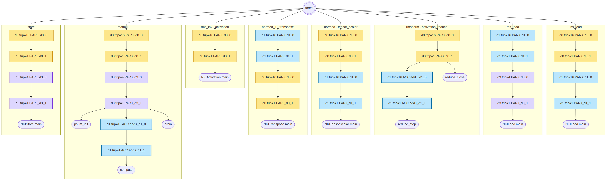
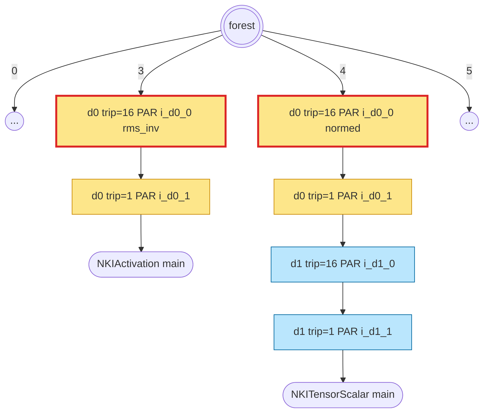
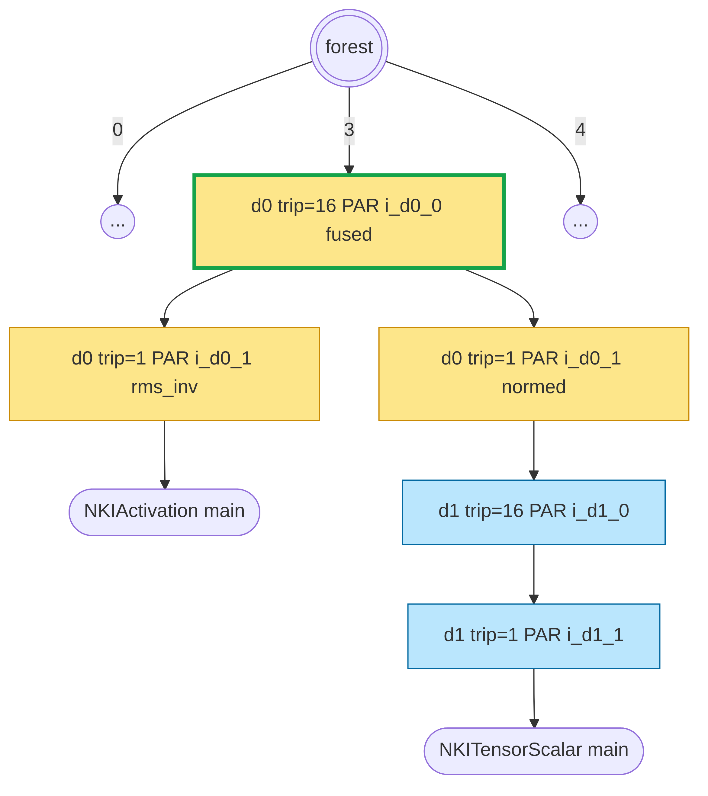
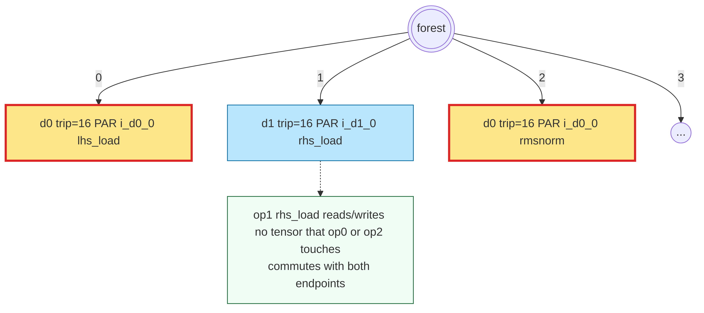
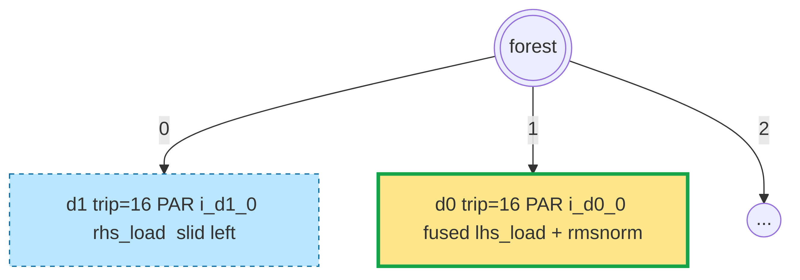
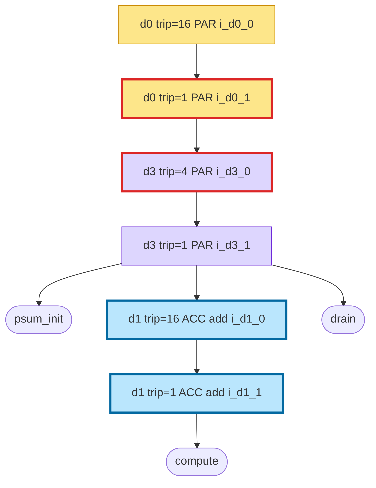
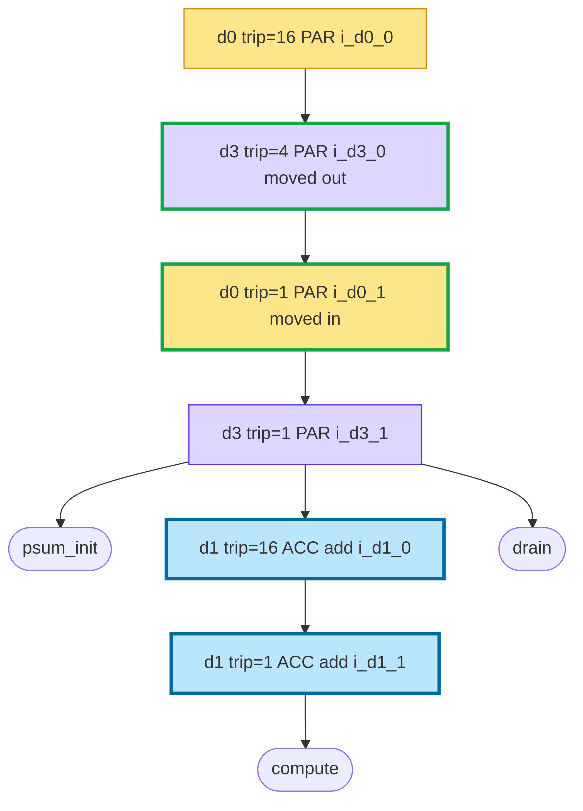

# Forest IR Visual Walkthrough

*Date: 2026-05-07*
*Status: Draft for review*

## 1. Context and Goal

The forest IR sits between the parsed `OpGraph` and the emitted NKI
kernel source. It is the surface `FuseLoops` and `ReorderLoops` mutate,
and it is what `render_forest` walks to emit `for` loops and op bodies.
The data structures are small (`LoopNode`, `BodyLeaf`, `LoopForest =
list[LoopNode | BodyLeaf]`) but the end-to-end shape of a real workload
is large enough that reading code line-by-line to reconstruct "what
does the tree look like here?" is tedious.

This doc replaces that reading-by-hand with a picture walkthrough on
one concrete workload — `examples/rmsnorm_matmul.py`. It shows:

1. The canonical forest `build_canonical_forest` produces from
   `f_nkigym`.
2. How three composed rewrites — one literal `FuseLoops`, one
   topological `FuseLoops`, one `ReorderLoops` — transform the forest
   step by step.
3. How the renderer lowers each intermediate forest to NKI source,
   annotated line-by-line with the forest node that produced each
   emitted line.

The ground-truth diagrams are auto-generated by a new
`dump_forest_mermaid` helper wired into `nkigym_compile`; the
simplified inline diagrams are hand-drawn for readability. Both live
in this folder.

### 1.1 Non-goals

- No coverage of `MultiBuffer` / `SoftwarePipeline` — both still in
  design (see `2026-05-07-multi-buffer-software-pipeline-design.md`),
  not shipped in code.
- No coverage of the batch sampler's frontier expansion; the rewrite
  chain shown is hand-picked for pedagogy, not replayed from a real
  tune run.
- No coverage of the op-local buffer emission rules or the op body
  emitters themselves beyond what §7 annotations imply.
- No new rewrite primitives, no changes to `FuseLoops` /
  `ReorderLoops` / `render`.

### 1.2 Reader

The target reader is me, and future-me, coming back to this code
without the context that built it. The doc assumes familiarity with
the vocabulary — NKI, SBUF/PSUM, `nisa.*`, op-local buffers — but no
memory of how the IR is shaped in this repo.

## 2. Deliverables

One self-contained design folder at the repo root,
`2026-05-07-forest-ir-visual-walkthrough-design/`:

```
design.md                          ← this file
diagrams/
  canonical.mmd + .png             ← §3 full-tree, hand-drawn
  step-a-before.mmd + .png         ← §4 literal FuseLoops
  step-a-after.mmd + .png
  step-b-before.mmd + .png         ← §5 topological FuseLoops
  step-b-after.mmd + .png
  step-c-before.mmd + .png         ← §6 ReorderLoops
  step-c-after.mmd + .png
kernels/
  canonical.py                     ← §7 annotated renders
  post-step-a.py
  post-step-b.py
  post-step-c.py
auto-dumps/                        ← appendix, frozen snapshots
  forest_initial.mmd + .png        ← from nkigym_compile hook
  forest_chain/                    ← from scripts/dump_forest_chain.py
    step_0.mmd + .png              ← canonical
    step_1.mmd + .png              ← after step A
    step_2.mmd + .png              ← after step B
    step_3.mmd + .png              ← after step C
    chain.json
```

All links in `design.md` are folder-relative so the doc is portable.
PNGs are generated via `mmdc -s 4`.

## 3. Data Model

Forest IR is a list of trees. Each tree's root is a `LoopNode` (one
tree per op in program order). Interior nodes are `LoopNode`s; leaves
are `BodyLeaf` markers.

### 3.1 `LoopNode` — interior

Fields that carry meaning:

| Field            | Purpose                                                  |
|------------------|----------------------------------------------------------|
| `dim_id`         | Concrete dim id (`"d0"`, `"d1"`, ...) this loop iterates |
| `trip_count`     | Iteration count. Canonical: `num_tiles(d)` for the block tier, `1` for the tile tier |
| `role`           | `AxisRole` — `PARALLEL` / `ACCUMULATION` / `SEQUENTIAL` |
| `reduce_op`      | Reducer name (`"add"`, `"max"`, ...) for `ACCUMULATION` loops; `None` otherwise |
| `children`       | Nested `LoopNode`s and/or `BodyLeaf`s, in emission order |
| `name`           | Emitted `for`-var name, `"i_<dim>_<k>"` where `k` counts same-dim ancestors outermost→innermost at build time |
| `pipeline_depth` | Reserved for `SoftwarePipeline` (default `1`, never touched by rewrites shipped today) |

### 3.2 `BodyLeaf` — terminal

Fields:

| Field     | Purpose                                                  |
|-----------|----------------------------------------------------------|
| `op_idx`  | Index into `OpGraph.ops` of the op this leaf represents |
| `phase`   | For multi-phase ops (matmul, activation_reduce). Single-phase ops use `"main"` |

### 3.3 Invariants that survive rewrites

- `name` and `reduce_op` — preserved verbatim across `FuseLoops` and
  `ReorderLoops`. Loop identity survives swaps and merges.
- Per-dim trip-product at every `BodyLeaf`: for each dim `d` in the
  leaf's phase-touched dims, the product of ancestor `trip_count`s
  where `dim_id == d` equals `num_tiles[d]`. Enforced by
  `check_invariant`. Both rewrites preserve it.
- Role-commutativity: `ReorderLoops` refuses swaps that would violate
  correctness (any `SEQUENTIAL` involvement; `ACC×ACC` without matching
  `reduce_op`).
- Three-field + topological adjacency: `FuseLoops` refuses merges
  whose endpoints don't share `(dim_id, trip_count, PARALLEL)` or
  whose intervening siblings don't commute with both endpoints per
  `op_graph.dep`.

## 4. Workload and canonical forest

`examples/rmsnorm_matmul.py` synthesises to the following `f_nkigym`
body (see `/home/ubuntu/cache/rmsnorm_matmul_compile/f_nkigym.py`):

```python
@nkigym_kernel
def f_nkigym(lhs, rhs):
    lhs_sbuf  = NKILoad()(data=lhs)
    rhs_sbuf  = NKILoad()(data=rhs)
    sum_sq    = NKIActivationReduce(op="square", reduce_op="add")(data=lhs_sbuf)
    rms_inv   = NKIActivation(op="rsqrt", scale=1.0 / 2048, bias=1e-06)(data=sum_sq)
    normed    = NKITensorScalar(op="multiply")(data=lhs_sbuf, operand0=rms_inv)
    normed_T  = NKITranspose()(data=normed)
    matmul_out = NKIMatmul()(stationary=normed_T, moving=rhs_sbuf)
    out       = NKIStore()(data=matmul_out)
    return out
```

**Eight ops, three working dims.** Per-op dim roles and touched dims
resolved from the kernel render:

| idx | op                    | outer dim (PAR) | rest of tree                  |
|-----|-----------------------|-----------------|-------------------------------|
| 0   | `NKILoad` (lhs)       | `d0` (M, 16)    | `d1` (K, 16)                  |
| 1   | `NKILoad` (rhs)       | `d1` (K, 16)    | `d3` (N, 4)                   |
| 2   | `NKIActivationReduce` | `d0`            | `d1` (F), then `reduce_close` |
| 3   | `NKIActivation`       | `d0`            | single leaf                   |
| 4   | `NKITensorScalar`     | `d0`            | `d1` (F)                      |
| 5   | `NKITranspose`        | `d1`            | `d0`                          |
| 6   | `NKIMatmul`           | `d0` (M)        | `d3` (N), then K-chain on `d1` (ACC, reduce_op=add) |
| 7   | `NKIStore`            | `d0`            | `d3`                          |

Every single-dim wrap is a **2-deep chain** — block tier (`trip_count =
num_tiles`) over tile tier (`trip_count = 1`) — per
`build_canonical_forest`'s 2N-per-dim rule. Matmul's K dim lives
inside the op tree and carries `reduce_op="add"`, because nc_matmul's
PSUM accumulator is summation. ActivationReduce's F dim lives inside
the op tree and carries the op's own `reduce_op` ("add" here).

The full canonical-forest Mermaid:



Source: `diagrams/canonical.mmd`. Verbatim auto-dump:
`auto-dumps/forest_initial.mmd` / `.png`.

## 5. Rewrite chain (composed, pedagogical)

Each step builds on the previous. Concrete atoms:

### 5.1 Step A — literal `FuseLoops`

Atom: `FuseLoops(path=(), boundary=(3, 4), dim_id="d0")`.

Fuses root sibling `[3] NKIActivation` with `[4] NKITensorScalar` —
adjacent, both `d0`-outer, both `PARALLEL` trip 16. The three-field
rule passes. `j == i + 1`, so no intervening-commutation check is
needed. After apply:

- Root sibling list shrinks from 8 → 7.
- New `[3]` is the fused `LoopNode(d0, trip=16, PAR, name="i_d0_0")`
  whose children are `producer.children ++ consumer.children` —
  concretely, two `d0_tile(trip=1, PAR)` nodes side by side, one
  inherited from activation's subtree, the other from
  tensor_scalar's. (These inner tiles are themselves a fresh
  fusable pair, but step A is the single atom shown here.)

Before (endpoints red):



After (fused parent green):



Sources: `diagrams/step-a-before.mmd`, `diagrams/step-a-after.mmd`.
Auto-dump: `auto-dumps/forest_chain/step_0.png` (before),
`step_1.png` (after).

### 5.2 Step B — topological `FuseLoops`

Starting from the step-A forest, atom:
`FuseLoops(path=(), boundary=(0, 2), dim_id="d0")`.

Fuses `[0] NKILoad (lhs)` with `[2] NKIActivationReduce` — both
`d0`-outer, both `PARALLEL` trip 16. `j - i == 2`, so the intervening
sibling `[1] NKILoad (rhs)` must commute with both endpoints per
`op_graph.dep`. `rhs_load` reads `rhs` and writes `sbuf_rhs`;
`lhs_load` reads `lhs` writes `sbuf_lhs`; `activation_reduce` reads
`sbuf_lhs` writes `sbuf_sum_sq` + `sbuf_local_1`. No tensor overlap
with `rhs_load` — all three judgments (RAW, WAR, WAW) return
"independent", so `commutes` is true for both endpoint pairs.

After apply:

- `rhs_load` slides left into slot 0.
- Fused `LoopNode(d0, trip=16, PAR, name="i_d0_0")` lands at slot 1
  (consumer's original j=2 slot, minus one for the survivor that
  slid left).
- Fused children = `lhs_load_subtree.children ++
  activation_reduce_subtree.children`.

Before (endpoints red, intervening sibling annotated):



After (rhs_load slid left, fused parent green):



Auto-dump: `auto-dumps/forest_chain/step_1.png` (before),
`step_2.png` (after).

### 5.3 Step C — `ReorderLoops` inside matmul

Starting from the step-B forest (6 roots), atom:
`ReorderLoops(path=(4, 0), outer_dim="d0", inner_dim="d3")`.

The matmul subtree (now at root slot 4) has shape:

```
d0_block(16, PAR)
└── d0_tile(1, PAR)         ← path (4, 0)
    └── d3_block(4, PAR)    ← single child, LoopNode ⇒ perfect nest
        └── d3_tile(1, PAR)
            └── [psum_init leaf, K-chain(reduce_op=add), drain leaf]
```

Target pair is `(d0_tile, d3_block)`. Both `PARALLEL` ⇒
`_roles_commute` returns `True`. Perfect-nest condition holds
(`len(d0_tile.children) == 1` and child is a `LoopNode`). After apply:

```
d0_block(16, PAR)
└── d3_block(4, PAR)        ← moved out
    └── d0_tile(1, PAR)     ← moved in, name="i_d0_1" preserved
        └── d3_tile(1, PAR) ← name="i_d3_1" preserved
            └── [psum_init leaf, K-chain, drain leaf]
```

`name` preserved verbatim: `i_d0_1` still names the former-outer loop
even at its new deeper tree position.

Before (swap pair red):



After (moved loops green; names preserved):



Auto-dump: `auto-dumps/forest_chain/step_2.png` (before),
`step_3.png` (after).

### 5.4 Why this chain

Step A introduces the three-field rule on the simplest case. Step B
adds the topological-adjacency rule on top. Step C introduces a
different rewrite kind — interchange — with its own legality
(`_roles_commute`), distinct from fusion. The three steps are
composed (B runs on A's output; C runs on B's output), so a reader
who follows the chain end-to-end sees how atom composition works in
practice.

## 6. Forest ↔ NKI source mapping

Four annotated kernels under `kernels/`:

- [`kernels/canonical.py`](kernels/canonical.py)
- [`kernels/post-step-a.py`](kernels/post-step-a.py)
- [`kernels/post-step-b.py`](kernels/post-step-b.py)
- [`kernels/post-step-c.py`](kernels/post-step-c.py)

Each emitted line carries a leading comment citing the forest node
that produced it:

```
# LoopNode(d0_block, trip=16, PAR, name="i_d0_0")  path=(2,)
for i_d0_0 in range(16):
    # LoopNode(d0_tile, trip=1, PAR, name="i_d0_1")  path=(2, 0)
    for i_d0_1 in range(1):
        ...
        # BodyLeaf(op_idx=2, phase="reduce_step")  path=(2, 0, 0, 0, 0)
        nisa.activation_reduce(...)
```

Annotations are inserted by a small post-render pass that walks the
forest in parallel with the emitted source (see §7.3). They are plain
Python comments — the kernel still runs as-is.

### 6.1 What the comments show

- Each `for` header names its `LoopNode` with `dim_id`, `trip_count`,
  `role`, and `name`.
- Each `nisa.*` / `nl.*` body call names its `BodyLeaf` with `op_idx`
  and `phase`.
- Each `path=(...)` is the tuple of child indices from the forest
  root — the same path `FuseLoops` / `ReorderLoops` take as their
  addressing coordinate.

This makes the forest↔source mapping readable without a side-by-side
layout.

### 6.2 Why diffs aren't a separate artifact

Each successive annotated kernel diffs cleanly against the prior one
(`diff kernels/post-step-a.py kernels/post-step-b.py`), so readers
who want the delta can run the diff themselves. We don't pre-bake
"diff highlight" annotations — they would clutter the main comments.

### 6.3 Annotated-render implementation

The §7 kernels are emitted by a small helper
`render_annotated(op_graph, forest) -> str` living alongside `render`
in `nkigym/codegen/render.py`. It runs the existing renderer and
threads a forest-walk in parallel that injects a `# LoopNode(...)` /
`# BodyLeaf(...)` comment directly above each `for`-header line and
each body dispatch. Shares the existing `_emit_node` recursion — no
duplication of emit logic.

## 7. Instrumentation

### 7.1 New helper

New module `nkigym/src/nkigym/codegen/mermaid.py`:

```python
def dump_forest_mermaid(forest: LoopForest, op_graph: OpGraph) -> str:
    """Return Mermaid `graph TD` source for a LoopForest.

    Node labels include every LoopNode / BodyLeaf field so the dump is
    a faithful record — no simplification, no abbreviation. Edges are
    parent→child with the child index as the edge label so `path`
    tuples are recoverable by eye.
    """
```

Naming convention for nodes in the emitted Mermaid:

- `LoopNode` → rounded rectangle. Label:
  `L{path}\ndim=<dim_id> trip=<n>\nrole=<role> name=<name>\nreduce_op=<r>`
  (last line elided when `reduce_op is None`).
- `BodyLeaf` → stadium shape. Label:
  `B{path}\nop=<op_name> phase=<phase>`.
- Edges carry the child index (`0`, `1`, ...) as their label.

Color convention (carries through to hand-drawn diagrams too):
one fill color per `dim_id`, bold border for `ACCUMULATION`, italic
label for `phase != "main"`.

### 7.2 Compile-time hook

One hook point in `nkigym/src/nkigym/compile.py`, at the end of
`_run_initial_codegen`: after `parse_and_resolve` +
`build_canonical_forest` + the existing `render` + CPU-sim, write
`cache_dir/forest_initial.mmd`.

Why only initial. The batch sampler's pool entries are
`(op_graph, forest)` tuples keyed by `hash_state` — the sampler does
not preserve per-kernel rewrite chains (see
`nkigym/tune/batch.py:enumerate_pool`). Tacking chain reconstruction
onto every compile would require either a predecessor-tracking
refactor of the sampler or a post-hoc path search through the pool
graph, both out of scope for this doc. Instead, the doc's step-by-step
chain is produced by a dedicated script (§7.3) that applies a fixed,
deterministic list of atoms. The `nkigym_compile` hook stays small —
one Mermaid dump per compile, well under 100 ms for this workload.

No new CLI flags. Default-on for every compile.

### 7.3 Chain-replay script

New file `scripts/dump_forest_chain.py`:

```
python scripts/dump_forest_chain.py \
    --cache-dir /home/ubuntu/cache/rmsnorm_matmul_compile \
    --out-dir   2026-05-07-forest-ir-visual-walkthrough-design/auto-dumps/forest_chain
```

The script loads the cached `f_nkigym.py`, parses it to an `OpGraph`,
builds the canonical forest, then applies the three fixed atoms from
§5 (step A, B, C) in order. After each atom it writes
`<out-dir>/step_K.mmd` via `dump_forest_mermaid`, and at the end
writes `chain.json` listing the atoms applied. Legality is verified
before each apply via `atom.is_legal(...)`; the script aborts loudly
on any illegal atom (the fixed chain should be legal on rmsnorm_matmul
— if it ever becomes illegal because the upstream IR changed, that's
a signal to revise this doc).

The script depends only on published helpers (`parse_and_resolve`,
`build_canonical_forest`, `FuseLoops`, `ReorderLoops`,
`dump_forest_mermaid`) — no private imports.

### 7.4 Frozen snapshot for this doc

The `auto-dumps/` folder in this design directory holds a committed
copy of:
- `forest_initial.{mmd,png}` — copied from the `nkigym_compile` hook
  output on the run that landed this doc.
- `forest_chain/step_K.{mmd,png}` and `chain.json` — output of
  `scripts/dump_forest_chain.py`.

Both sets are committed so the appendix renders without regenerating.
When the IR changes in a way that invalidates these snapshots, rerun
the compile + script and update the PNGs.

### 7.5 Annotated-render helper

`render_annotated` in `nkigym/codegen/render.py` is a second public
entry point alongside `render`. Used by
`scripts/dump_annotated_kernels.py` to produce `kernels/canonical.py`
through `kernels/post-step-c.py`. No compile-time hook — it is a
utility used only by doc generation scripts.

## 8. What this doc deliberately omits

- The batch sampler's frontier algorithm — covered in the
  `2026-05-05-unified-tune-stage-design.md` spec.
- Rendering of op-local buffers, HBM/SBUF placement rules, the op
  body dispatch table — covered in the
  `2026-05-05-eager-renderer-design.md` spec and the
  `2026-05-05-block-tile-loops-design.md` spec.
- The DepGraph construction — covered in the
  `2026-05-06-topological-loop-fusion-design.md` spec.
- `MultiBuffer` / `SoftwarePipeline` — covered in the
  `2026-05-07-multi-buffer-software-pipeline-design.md` spec.

This doc builds on those four; read them for depth on each
subsystem. The walkthrough here is the glue that shows them running
together on a single concrete workload.

## 9. Appendix — auto-generated dumps

`auto-dumps/forest_initial.{mmd,png}` is the verbatim canonical forest
that `dump_forest_mermaid` produces for this workload — no hand
simplification. Field values in the labels match what the renderer
sees. Useful as ground truth to compare against the hand-drawn §4
diagram.

`auto-dumps/forest_chain/` holds the rewrite chain produced by
`scripts/dump_forest_chain.py` — the three fixed atoms from §5 (step
A, B, C) applied deterministically to the canonical forest.
`chain.json` lists the atoms; `step_K.{mmd,png}` shows the forest
after the k-th atom. These ARE the same three atoms the main
walkthrough uses; the simplified inline diagrams are hand-drawn
abstractions of the same states.
