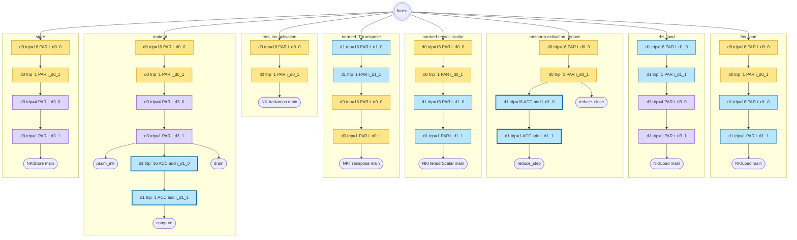
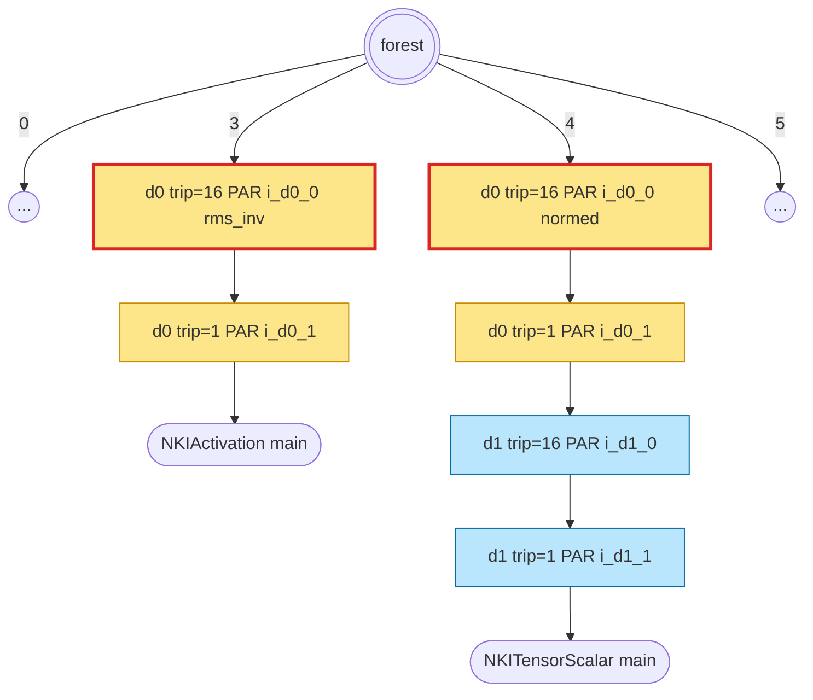
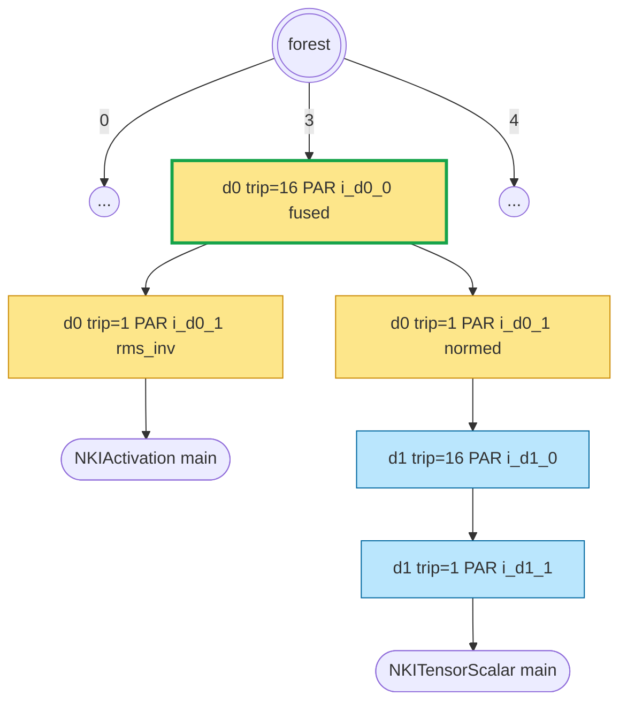
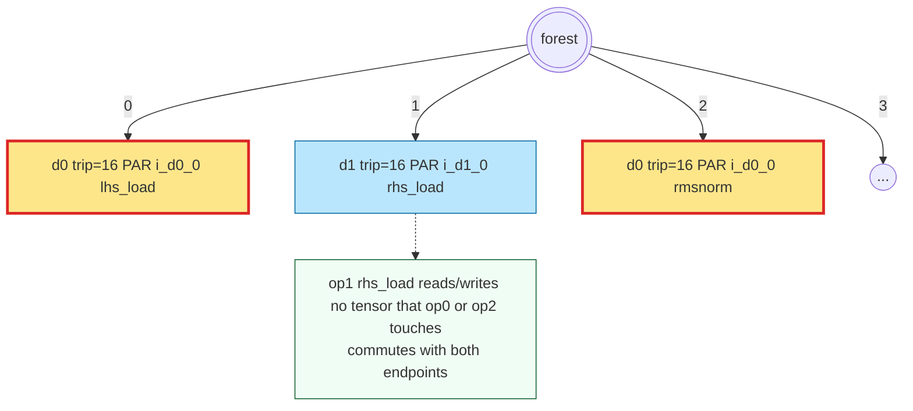
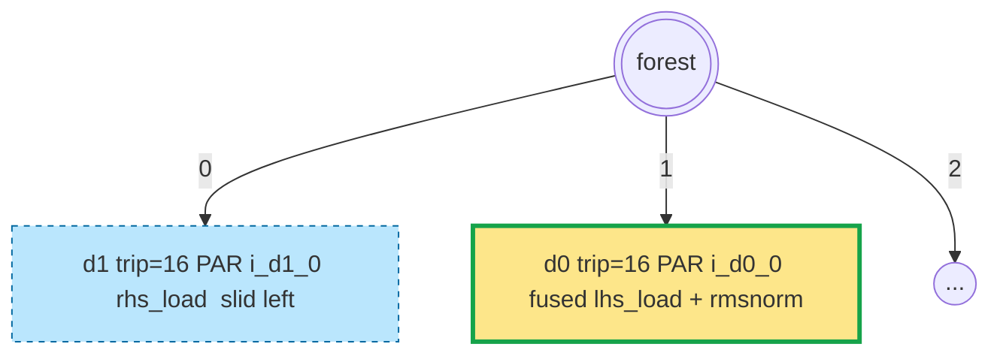
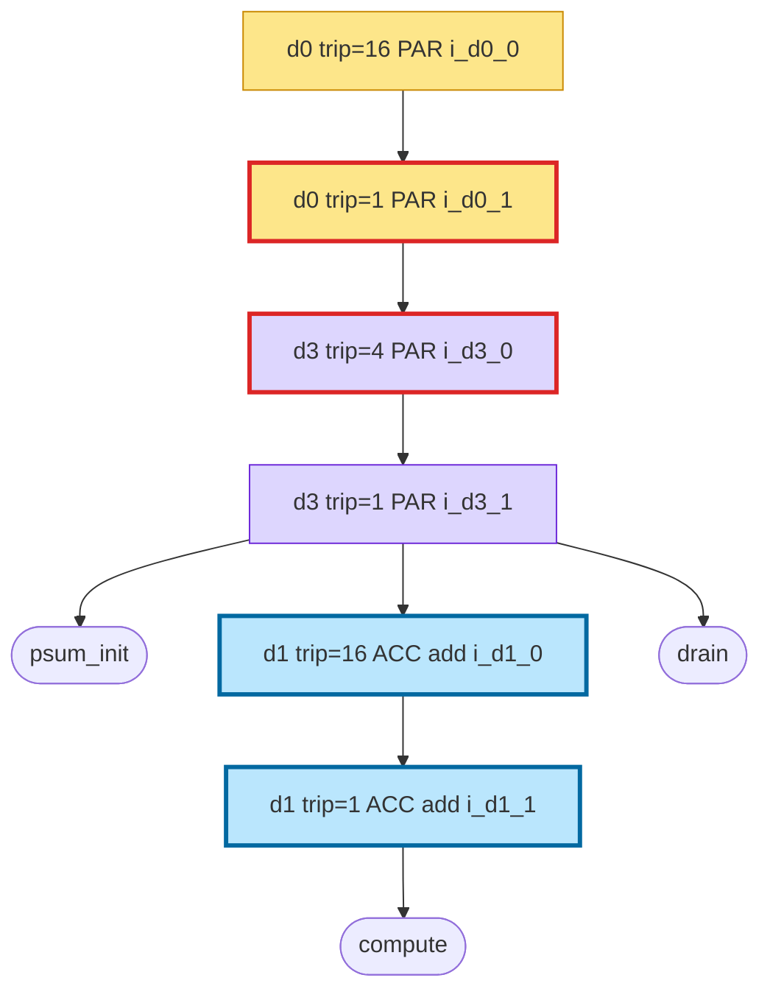
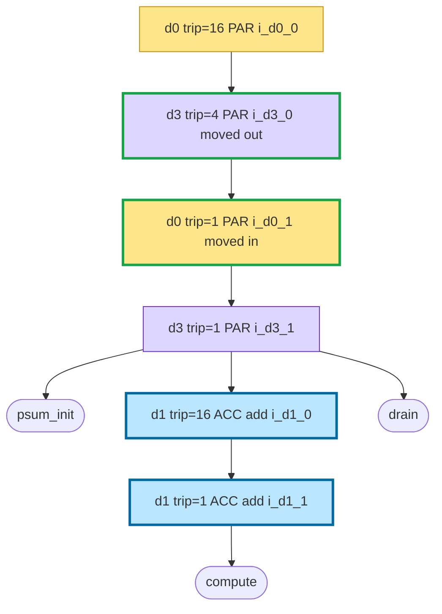

# Forest IR Visual Walkthrough Implementation Plan

> **For agentic workers:** REQUIRED SUB-SKILL: Use superpowers:subagent-driven-development (recommended) or superpowers:executing-plans to implement this plan task-by-task. Steps use checkbox (`- [ ]`) syntax for tracking.

**Goal:** Ship a self-contained design-review folder (diagrams + annotated kernels + design.md) that visualises the forest IR and three composed rewrites on `rmsnorm_matmul`, plus the two small helpers required to produce the auto-generated artifacts.

**Architecture:** Two new library helpers (`dump_forest_mermaid` — Mermaid serialiser; `render_annotated` — NKI source with inline forest-node comments), one hook in `nkigym_compile._run_initial_codegen`, two standalone scripts (`scripts/dump_forest_chain.py`, `scripts/dump_annotated_kernels.py`), seven hand-drawn `.mmd` diagrams, and the `design.md` already committed under `2026-05-07-forest-ir-visual-walkthrough-design/`.

**Tech Stack:** Python 3.12, `nkigym/codegen/{loop_forest,graph,render}.py` + `nkigym/tune/{fuse_loops,reorder_loops}.py`, Mermaid (`mmdc` CLI v11 installed at `/usr/local/bin/mmdc`), pytest.

---

## File Structure

- Create: `nkigym/src/nkigym/codegen/mermaid.py` — `dump_forest_mermaid(forest, op_graph) -> str`. ~80 lines. Lives in `codegen/` because it operates purely on `LoopForest` + `OpGraph`.
- Modify: `nkigym/src/nkigym/codegen/render.py` — add `render_annotated(op_graph, forest) -> str` that emits the existing source but with a `# LoopNode(...)` / `# BodyLeaf(...)` comment above each loop header and each body dispatch. Implement by adding two optional comment-emitting knobs inside `_emit_node` and routing them via a small public wrapper. ~40 lines added; no behavioural change to `render`.
- Modify: `nkigym/src/nkigym/compile.py` — at the end of `_run_initial_codegen`, call `dump_forest_mermaid` and write `cache_dir/forest_initial.mmd`. ~10 lines added.
- Create: `scripts/dump_forest_chain.py` — standalone, loads cached `f_nkigym.py`, applies the three fixed atoms from design §5, writes `step_0..step_3.mmd` + `chain.json`. ~100 lines.
- Create: `scripts/dump_annotated_kernels.py` — standalone, same chain, writes `canonical.py / post-step-{a,b,c}.py` via `render_annotated`. ~70 lines.
- Create: `test/codegen/test_mermaid_dump.py` — unit tests for `dump_forest_mermaid`. ~60 lines.
- Create: `test/codegen/test_render_annotated.py` — unit tests for `render_annotated`. ~50 lines.
- Create: `test/test_dump_forest_chain_script.py` — end-to-end test invoking the script on the cached workload. ~40 lines.
- Create: `test/test_dump_annotated_kernels_script.py` — end-to-end test for the annotated-kernels script. ~40 lines.
- Create (artifact): `2026-05-07-forest-ir-visual-walkthrough-design/diagrams/canonical.mmd` + six step diagrams — hand-authored Mermaid.
- Create (artifact, script output): `2026-05-07-forest-ir-visual-walkthrough-design/auto-dumps/forest_initial.{mmd,png}`, `auto-dumps/forest_chain/step_{0..3}.{mmd,png}`, `auto-dumps/forest_chain/chain.json`.
- Create (artifact, script output): `2026-05-07-forest-ir-visual-walkthrough-design/kernels/{canonical,post-step-a,post-step-b,post-step-c}.py`.

---

## Task 1: `dump_forest_mermaid` helper — skeleton + empty-forest case

**Files:**
- Create: `nkigym/src/nkigym/codegen/mermaid.py`
- Test: `test/codegen/test_mermaid_dump.py`

- [ ] **Step 1: Write the failing test for an empty forest**

File: `test/codegen/test_mermaid_dump.py`

```python
"""Unit tests for the dump_forest_mermaid helper."""

from dataclasses import dataclass, field

from nkigym.codegen.graph import DimInfo, OpGraph
from nkigym.codegen.mermaid import dump_forest_mermaid


class _FakeOpClass:
    """Stand-in for an NKIOp subclass — only __name__ is consulted."""

    __name__ = "FakeOp"


@dataclass
class _FakeOp:
    """Stand-in for ParsedOp — only op_cls is consulted by dump_forest_mermaid."""

    op_cls: type = field(default_factory=lambda: _FakeOpClass)
    idx: int = 0


def _empty_op_graph() -> OpGraph:
    """An OpGraph with no ops, no tensors — used by the empty-forest test."""
    return OpGraph(
        func_name="f_empty",
        param_names=[],
        return_name="",
        tensors={},
        dims={},
        ops=[],
    )


def test_dump_empty_forest_emits_graph_td_header_only() -> None:
    """An empty forest renders to just the 'graph TD' header line and nothing else."""
    src = dump_forest_mermaid(forest=[], op_graph=_empty_op_graph())
    assert src.splitlines() == ["graph TD"]
```

- [ ] **Step 2: Run the test to verify it fails**

Run: `source ~/venvs/kernel-env/bin/activate && pytest test/codegen/test_mermaid_dump.py::test_dump_empty_forest_emits_graph_td_header_only -v`
Expected: FAIL with `ModuleNotFoundError: No module named 'nkigym.codegen.mermaid'`

- [ ] **Step 3: Create the module with a stub that passes the empty case**

File: `nkigym/src/nkigym/codegen/mermaid.py`

```python
"""Mermaid `graph TD` serialiser for :class:`LoopForest`.

Produces a verbose, faithful rendering of the forest IR suitable for
auto-dumps and debugging. Labels include every meaningful
``LoopNode`` / ``BodyLeaf`` field; edge labels are the child index so
``path`` tuples can be read off the picture.
"""

from nkigym.codegen.graph import OpGraph
from nkigym.codegen.loop_forest import LoopForest


def dump_forest_mermaid(forest: LoopForest, op_graph: OpGraph) -> str:
    """Return Mermaid `graph TD` source for ``forest``.

    Args:
        forest: The forest to serialise.
        op_graph: Used to resolve ``BodyLeaf.op_idx`` into op-class names.

    Returns:
        Mermaid source — starts with ``graph TD``. An empty forest
        produces exactly that single line (no nodes, no edges).
    """
    _ = op_graph
    lines: list[str] = ["graph TD"]
    if not forest:
        return "\n".join(lines)
    raise NotImplementedError("non-empty forest not yet implemented")
```

- [ ] **Step 4: Run the test to verify it passes**

Run: `source ~/venvs/kernel-env/bin/activate && pytest test/codegen/test_mermaid_dump.py::test_dump_empty_forest_emits_graph_td_header_only -v`
Expected: PASS

- [ ] **Step 5: Commit**

```bash
git add nkigym/src/nkigym/codegen/mermaid.py test/codegen/test_mermaid_dump.py
git commit -m "$(cat <<'EOF'
codegen: dump_forest_mermaid skeleton with empty-forest case

Adds nkigym/codegen/mermaid.py returning the Mermaid 'graph TD'
header. Non-empty forests raise NotImplementedError until the next
task.

Co-Authored-By: Claude Opus 4.7 (1M context) <noreply@anthropic.com>
EOF
)"
```

---

## Task 2: `dump_forest_mermaid` — single `LoopNode` with one `BodyLeaf` child

**Files:**
- Modify: `nkigym/src/nkigym/codegen/mermaid.py`
- Test: `test/codegen/test_mermaid_dump.py`

- [ ] **Step 1: Write the failing test**

Append to `test/codegen/test_mermaid_dump.py`:

```python
from nkigym.codegen.loop_forest import BodyLeaf, LoopNode
from nkigym.ops.base import AxisRole


def test_dump_single_loop_with_leaf_child() -> None:
    """One LoopNode with one BodyLeaf child renders as two nodes + one edge."""
    leaf = BodyLeaf(op_idx=0, phase="main")
    node = LoopNode(dim_id="d0", trip_count=16, role=AxisRole.PARALLEL, children=[leaf], name="i_d0_0")
    forest = [node]
    og = OpGraph(
        func_name="f",
        param_names=[],
        return_name="",
        tensors={},
        dims={"d0": DimInfo(dim_id="d0", total_size=2048, tile_size=128, num_tiles=16)},
        ops=[_FakeOp()],
    )
    src = dump_forest_mermaid(forest=forest, op_graph=og)
    lines = src.splitlines()
    assert lines[0] == "graph TD"
    joined = "\n".join(lines[1:])
    assert 'L_0["L(0,)<br/>dim=d0 trip=16<br/>role=PARALLEL name=i_d0_0"]' in joined
    assert 'B_0_0(["B(0, 0)<br/>op=FakeOp phase=main"])' in joined
    assert "L_0 -- 0 --> B_0_0" in joined
```

(The `_FakeOp` / `_FakeOpClass` helpers are already at the top of the file from Task 1 — no additional definitions needed here.)

- [ ] **Step 2: Run the test to verify it fails**

Run: `pytest test/codegen/test_mermaid_dump.py::test_dump_single_loop_with_leaf_child -v`
Expected: FAIL with `NotImplementedError: non-empty forest not yet implemented`

- [ ] **Step 3: Implement the walker**

Replace the body of `dump_forest_mermaid` in `nkigym/src/nkigym/codegen/mermaid.py`:

```python
def dump_forest_mermaid(forest: LoopForest, op_graph: OpGraph) -> str:
    """Return Mermaid `graph TD` source for ``forest``.

    Args:
        forest: The forest to serialise.
        op_graph: Used to resolve ``BodyLeaf.op_idx`` into op-class names.

    Returns:
        Mermaid source — starts with ``graph TD``. An empty forest
        produces exactly that single line (no nodes, no edges).
    """
    lines: list[str] = ["graph TD"]
    for root_idx, root in enumerate(forest):
        _emit(lines, root, path=(root_idx,), op_graph=op_graph, parent_id=None, child_idx=None)
    return "\n".join(lines)


def _emit(
    lines: list[str],
    node,
    path: tuple[int, ...],
    op_graph: OpGraph,
    parent_id: str | None,
    child_idx: int | None,
) -> None:
    """Recursively emit node + outgoing edge, depth-first."""
    from nkigym.codegen.loop_forest import BodyLeaf, LoopNode

    node_id = _node_id(node, path)
    label = _node_label(node, path, op_graph)
    if isinstance(node, LoopNode):
        lines.append(f'{node_id}["{label}"]')
    else:
        lines.append(f'{node_id}(["{label}"])')
    if parent_id is not None:
        lines.append(f"{parent_id} -- {child_idx} --> {node_id}")
    if isinstance(node, LoopNode):
        for i, child in enumerate(node.children):
            _emit(lines, child, path=path + (i,), op_graph=op_graph, parent_id=node_id, child_idx=i)


def _node_id(node, path: tuple[int, ...]) -> str:
    """Mermaid node id derived from path. L_/B_ prefix + underscore-joined path."""
    from nkigym.codegen.loop_forest import LoopNode

    prefix = "L" if isinstance(node, LoopNode) else "B"
    suffix = "_".join(str(p) for p in path)
    return f"{prefix}_{suffix}"


def _node_label(node, path: tuple[int, ...], op_graph: OpGraph) -> str:
    """Human-readable label — multi-line, fields joined with <br/>."""
    from nkigym.codegen.loop_forest import BodyLeaf, LoopNode

    if isinstance(node, BodyLeaf):
        op_name = op_graph.ops[node.op_idx].op_cls.__name__
        return f"B({', '.join(str(p) for p in path)})<br/>op={op_name} phase={node.phase}"
    assert isinstance(node, LoopNode)
    parts = [
        f"L({', '.join(str(p) for p in path)})",
        f"dim={node.dim_id} trip={node.trip_count}",
        f"role={node.role.name} name={node.name}",
    ]
    if node.reduce_op is not None:
        parts.append(f"reduce_op={node.reduce_op}")
    return "<br/>".join(parts)
```

- [ ] **Step 4: Run the test to verify it passes**

Run: `pytest test/codegen/test_mermaid_dump.py -v`
Expected: all tests PASS

- [ ] **Step 5: Commit**

```bash
git add nkigym/src/nkigym/codegen/mermaid.py test/codegen/test_mermaid_dump.py
git commit -m "$(cat <<'EOF'
codegen: dump_forest_mermaid walks LoopNode / BodyLeaf trees

Emits one Mermaid node per forest entry plus a parent->child edge
labelled with the child index so path tuples are recoverable. Node
labels carry every meaningful LoopNode / BodyLeaf field (dim_id,
trip_count, role, name, reduce_op when non-None; op_cls name and
phase for leaves).

Co-Authored-By: Claude Opus 4.7 (1M context) <noreply@anthropic.com>
EOF
)"
```

---

## Task 3: `dump_forest_mermaid` — verify against real canonical forest

**Files:**
- Test: `test/codegen/test_mermaid_dump.py`

- [ ] **Step 1: Write the failing test**

Append to `test/codegen/test_mermaid_dump.py`:

```python
from nkigym.codegen.graph import parse_and_resolve
from nkigym.codegen.loop_forest import build_canonical_forest

from ._rmsnorm_matmul_fixture import INPUT_SPECS, f_nkigym


def test_dump_canonical_rmsnorm_matmul_forest_is_well_formed() -> None:
    """End-to-end smoke: dump the real canonical rmsnorm+matmul forest."""
    op_graph = parse_and_resolve(f_nkigym, INPUT_SPECS)
    forest = build_canonical_forest(op_graph)
    src = dump_forest_mermaid(forest=forest, op_graph=op_graph)
    assert src.startswith("graph TD\n")
    assert len(forest) == 8
    assert src.count("\nL_0[") == 1
    assert src.count("\nL_1[") == 1
    assert src.count("\nL_7[") == 1
    assert "NKILoad" in src
    assert "NKIMatmul" in src
    assert "phase=psum_init" in src
    assert "phase=compute" in src
    assert "phase=drain" in src
    assert "reduce_op=add" in src
```

- [ ] **Step 2: Run the test to verify it fails or passes**

Run: `pytest test/codegen/test_mermaid_dump.py::test_dump_canonical_rmsnorm_matmul_forest_is_well_formed -v`
Expected: PASS if Task 2's implementation is complete — this is a coverage test, not driving new code.

If it fails, the most likely cause is that the fixture module path (`test/codegen/_rmsnorm_matmul_fixture.py`) uses a relative import form that pytest rejects. If so, change the import to:

```python
from test.codegen._rmsnorm_matmul_fixture import INPUT_SPECS, f_nkigym
```

- [ ] **Step 3: Commit**

```bash
git add test/codegen/test_mermaid_dump.py
git commit -m "$(cat <<'EOF'
codegen: dump_forest_mermaid coverage test on rmsnorm+matmul

End-to-end smoke: parses f_nkigym, builds the canonical forest, dumps
to Mermaid, and asserts every meaningful op + phase + reduce_op
appears in the output. Guards against regressions in node labelling.

Co-Authored-By: Claude Opus 4.7 (1M context) <noreply@anthropic.com>
EOF
)"
```

---

## Task 4: Hook `dump_forest_mermaid` into `_run_initial_codegen`

**Files:**
- Modify: `nkigym/src/nkigym/compile.py:118-131`
- Test: `test/codegen/test_compile.py` (new test added at end of file)

- [ ] **Step 1: Write the failing test**

Append to `test/codegen/test_compile.py`:

```python
def test_initial_codegen_writes_forest_initial_mmd(tmp_path) -> None:
    """After _run_initial_codegen, cache_dir contains forest_initial.mmd."""
    import shutil
    from nkigym.compile import _run_initial_codegen
    from ._rmsnorm_matmul_fixture import INPUT_SPECS, f_numpy

    cache_src = "/home/ubuntu/cache/rmsnorm_matmul_compile"
    shutil.copy(f"{cache_src}/f_nkigym.py", tmp_path / "f_nkigym.py")

    _run_initial_codegen(f_numpy, INPUT_SPECS, tmp_path)

    mmd_path = tmp_path / "forest_initial.mmd"
    assert mmd_path.exists()
    src = mmd_path.read_text()
    assert src.startswith("graph TD\n")
    assert "NKIMatmul" in src
    assert "phase=psum_init" in src
```

- [ ] **Step 2: Run the test to verify it fails**

Run: `pytest test/codegen/test_compile.py::test_initial_codegen_writes_forest_initial_mmd -v`
Expected: FAIL with `AssertionError: forest_initial.mmd does not exist`

- [ ] **Step 3: Add the hook**

Edit `nkigym/src/nkigym/compile.py`, the `_run_initial_codegen` function. Find:

```python
def _run_initial_codegen(
    f_numpy: Callable[..., np.ndarray], input_specs: dict[str, tuple[tuple[int, ...], str]], cache_path: Path
) -> None:
    """Render the eager NKI kernel, write ``kernel.py``, and CPU-sim-check it."""
    f_nkigym_path = cache_path / "f_nkigym.py"
    if not f_nkigym_path.exists():
        raise ValueError(
            f"initial_codegen requires {f_nkigym_path!s} — run the 'synthesis' stage first "
            f"or place the file manually before invoking this stage."
        )
    f_nkigym = _load_f_nkigym(f_nkigym_path)
    kernel_source = render_eager(f_nkigym, input_specs)
    (cache_path / "kernel.py").write_text(kernel_source)
    _cpu_sim_check(kernel_source, f_nkigym.__name__, f_numpy, input_specs)
```

Replace the call to `render_eager` and the write with the expanded body that also dumps the Mermaid:

```python
def _run_initial_codegen(
    f_numpy: Callable[..., np.ndarray], input_specs: dict[str, tuple[tuple[int, ...], str]], cache_path: Path
) -> None:
    """Render the eager NKI kernel, write ``kernel.py`` and ``forest_initial.mmd``, and CPU-sim-check."""
    f_nkigym_path = cache_path / "f_nkigym.py"
    if not f_nkigym_path.exists():
        raise ValueError(
            f"initial_codegen requires {f_nkigym_path!s} — run the 'synthesis' stage first "
            f"or place the file manually before invoking this stage."
        )
    f_nkigym = _load_f_nkigym(f_nkigym_path)
    op_graph = parse_and_resolve(f_nkigym, input_specs)
    forest = build_canonical_forest(op_graph)
    kernel_source = render(op_graph, forest=forest)
    (cache_path / "kernel.py").write_text(kernel_source)
    (cache_path / "forest_initial.mmd").write_text(dump_forest_mermaid(forest=forest, op_graph=op_graph))
    _cpu_sim_check(kernel_source, f_nkigym.__name__, f_numpy, input_specs)
```

Also at the top of `nkigym/src/nkigym/compile.py`, replace the `from nkigym.codegen import render_eager` line with:

```python
from nkigym.codegen.graph import parse_and_resolve
from nkigym.codegen.loop_forest import build_canonical_forest
from nkigym.codegen.mermaid import dump_forest_mermaid
from nkigym.codegen.render import render
```

Remove `from nkigym.codegen import render_eager` if it becomes unused.

- [ ] **Step 4: Run the test to verify it passes**

Run: `pytest test/codegen/test_compile.py::test_initial_codegen_writes_forest_initial_mmd -v`
Expected: PASS

- [ ] **Step 5: Run the full codegen test suite to make sure nothing broke**

Run: `pytest test/codegen/ -v`
Expected: all PASS. If `render_eager` is still used elsewhere (check its definition in `nkigym/codegen/__init__.py`), keep the import. Otherwise leave it out.

- [ ] **Step 6: Commit**

```bash
git add nkigym/src/nkigym/compile.py test/codegen/test_compile.py
git commit -m "$(cat <<'EOF'
compile: dump forest_initial.mmd alongside kernel.py

_run_initial_codegen now builds the canonical forest explicitly and
passes it to render, then dumps the same forest via
dump_forest_mermaid. Adds forest_initial.mmd to every compile's
cache_dir without changing the kernel render.

Co-Authored-By: Claude Opus 4.7 (1M context) <noreply@anthropic.com>
EOF
)"
```

---

## Task 5: `render_annotated` helper — thread comment emission through `_emit_node`

**Files:**
- Modify: `nkigym/src/nkigym/codegen/render.py`
- Test: `test/codegen/test_render_annotated.py`

- [ ] **Step 1: Write the failing test**

File: `test/codegen/test_render_annotated.py`

```python
"""Unit tests for render_annotated — forest-node comments inline in NKI source."""

from nkigym.codegen.graph import parse_and_resolve
from nkigym.codegen.loop_forest import build_canonical_forest
from nkigym.codegen.render import render, render_annotated

from ._rmsnorm_matmul_fixture import INPUT_SPECS, f_nkigym


def test_render_annotated_is_superset_of_render() -> None:
    """Stripping comment lines from render_annotated output yields the plain render."""
    op_graph = parse_and_resolve(f_nkigym, INPUT_SPECS)
    forest = build_canonical_forest(op_graph)
    plain = render(op_graph, forest=forest)
    annotated = render_annotated(op_graph, forest=forest)
    stripped = "\n".join(line for line in annotated.splitlines() if not line.strip().startswith("# ")) + "\n"
    assert stripped == plain


def test_render_annotated_includes_loopnode_comment_above_every_for_header() -> None:
    """Every `for ... in range(...)` line has a preceding `# LoopNode(...)` comment."""
    op_graph = parse_and_resolve(f_nkigym, INPUT_SPECS)
    forest = build_canonical_forest(op_graph)
    annotated = render_annotated(op_graph, forest=forest).splitlines()
    for i, line in enumerate(annotated):
        if line.strip().startswith("for ") and " in range(" in line:
            prev = annotated[i - 1].strip()
            assert prev.startswith("# LoopNode("), f"missing annotation above: {line!r}"


def test_render_annotated_includes_bodyleaf_comment_above_top_level_body_dispatch() -> None:
    """At least one `# BodyLeaf(` comment appears somewhere in the annotated output."""
    op_graph = parse_and_resolve(f_nkigym, INPUT_SPECS)
    forest = build_canonical_forest(op_graph)
    annotated = render_annotated(op_graph, forest=forest)
    assert "# BodyLeaf(" in annotated
    assert 'phase="psum_init"' in annotated
    assert 'phase="compute"' in annotated
    assert 'phase="drain"' in annotated
```

- [ ] **Step 2: Run the test to verify it fails**

Run: `pytest test/codegen/test_render_annotated.py -v`
Expected: FAIL with `ImportError: cannot import name 'render_annotated'`

- [ ] **Step 3: Implement `render_annotated`**

Edit `nkigym/src/nkigym/codegen/render.py`. After the existing `render` function, add:

```python
def render_annotated(op_graph: OpGraph, forest: LoopForest | None = None) -> str:
    """Render like :func:`render`, but with forest-node comments inline.

    Every emitted ``for`` header is preceded by a ``# LoopNode(...)``
    comment, and every body dispatch is preceded by a
    ``# BodyLeaf(...)`` comment. Comments are standard Python lines, so
    the kernel runs unchanged.

    Shares the main render pipeline — only the forest walker is
    replaced with an annotating variant. All other emit helpers (SBUF
    allocation, signature, asserts, body emitters) are reused verbatim.
    """
    if forest is None:
        forest = build_canonical_forest(op_graph)
    w = _Writer()
    _emit_imports(w)
    _emit_signature(w, op_graph)
    w.indent()
    _emit_param_asserts(w, op_graph)
    _emit_hbm_output(w, op_graph)
    _emit_sbuf_allocations(w, op_graph)
    _render_forest_annotated(w, op_graph, forest)
    w.line(f"return {_hbm_name(op_graph.return_name)}")
    w.dedent()
    return w.getvalue()


def _render_forest_annotated(w: _Writer, op_graph: OpGraph, forest: LoopForest) -> None:
    """Walk ``forest`` emitting source with per-node comments above each emission."""
    path_names: dict[str, list[str]] = {}
    path_trips: dict[str, list[int]] = {}
    for idx, entry in enumerate(forest):
        _emit_node_annotated(w, op_graph, entry, path_names, path_trips, path=(idx,))


def _emit_node_annotated(
    w: _Writer,
    op_graph: OpGraph,
    node: LoopNode | BodyLeaf,
    path_names: dict[str, list[str]],
    path_trips: dict[str, list[int]],
    path: tuple[int, ...],
) -> None:
    """Like :func:`_emit_node` but emits `# LoopNode(...)` / `# BodyLeaf(...)` above each emission."""
    if isinstance(node, BodyLeaf):
        op = op_graph.ops[node.op_idx]
        emitter = _BODY_EMITTERS.get((op.op_cls.__name__, node.phase))
        if emitter is None:
            raise ValueError(f"No body emitter registered for ({op.op_cls.__name__!r}, {node.phase!r})")
        w.line(f'# BodyLeaf(op_idx={node.op_idx}, phase="{node.phase}")  path={path}')
        emitter(w, op_graph, op, path_names, path_trips)
        return
    existing = path_names.setdefault(node.dim_id, [])
    loop_var = node.name if node.name is not None else f"i_{node.dim_id}_{len(existing)}"
    w.line(
        f'# LoopNode(dim_id="{node.dim_id}", trip={node.trip_count}, '
        f'role={node.role.name}, name="{node.name}")  path={path}'
    )
    w.line(f"for {loop_var} in range({node.trip_count}):")
    w.indent()
    existing.append(loop_var)
    path_trips.setdefault(node.dim_id, []).append(node.trip_count)
    for i, child in enumerate(node.children):
        _emit_node_annotated(w, op_graph, child, path_names, path_trips, path=path + (i,))
    path_trips[node.dim_id].pop()
    existing.pop()
    w.dedent()
```

- [ ] **Step 4: Run the test to verify it passes**

Run: `pytest test/codegen/test_render_annotated.py -v`
Expected: all three tests PASS

- [ ] **Step 5: Run the full codegen test suite to make sure nothing broke**

Run: `pytest test/codegen/ -v`
Expected: all PASS

- [ ] **Step 6: Commit**

```bash
git add nkigym/src/nkigym/codegen/render.py test/codegen/test_render_annotated.py
git commit -m "$(cat <<'EOF'
codegen: render_annotated emits NKI source with forest-node comments

New public entry point alongside render. Threads a parallel annotator
through the forest walker that prints '# LoopNode(...)' above each
for header and '# BodyLeaf(...)' above each body dispatch, with the
forest path tuple attached. Shares all other emit helpers (asserts,
SBUF alloc, body emitters) verbatim with render. Stripping the '# '
lines recovers the plain render byte-for-byte.

Co-Authored-By: Claude Opus 4.7 (1M context) <noreply@anthropic.com>
EOF
)"
```

---

## Task 6: `scripts/dump_forest_chain.py` — fixed-atom replay

**Files:**
- Create: `scripts/dump_forest_chain.py`
- Test: `test/test_dump_forest_chain_script.py`

- [ ] **Step 1: Write the failing test**

File: `test/test_dump_forest_chain_script.py`

```python
"""End-to-end test: scripts/dump_forest_chain.py on a cached workload."""

import json
import shutil
import subprocess
import sys
from pathlib import Path


def test_script_writes_step_mmds_and_chain_json(tmp_path: Path) -> None:
    """Running the script writes step_0..step_3.mmd and chain.json."""
    cache_src = Path("/home/ubuntu/cache/rmsnorm_matmul_compile")
    assert (cache_src / "f_nkigym.py").exists(), "fixture cache missing — run rmsnorm_matmul.py first"
    cache_dir = tmp_path / "cache"
    cache_dir.mkdir()
    shutil.copy(cache_src / "f_nkigym.py", cache_dir / "f_nkigym.py")
    out_dir = tmp_path / "forest_chain"
    result = subprocess.run(
        [
            sys.executable,
            "scripts/dump_forest_chain.py",
            "--cache-dir",
            str(cache_dir),
            "--out-dir",
            str(out_dir),
        ],
        capture_output=True,
        text=True,
    )
    assert result.returncode == 0, f"stdout={result.stdout!r} stderr={result.stderr!r}"
    for k in range(4):
        mmd = out_dir / f"step_{k}.mmd"
        assert mmd.exists(), f"missing {mmd}"
        src = mmd.read_text()
        assert src.startswith("graph TD\n")
    chain = json.loads((out_dir / "chain.json").read_text())
    assert len(chain) == 3
    assert chain[0]["kind"] == "FuseLoops"
    assert chain[1]["kind"] == "FuseLoops"
    assert chain[2]["kind"] == "ReorderLoops"
```

- [ ] **Step 2: Run the test to verify it fails**

Run: `pytest test/test_dump_forest_chain_script.py -v`
Expected: FAIL with a FileNotFoundError or returncode!=0 (script does not exist).

- [ ] **Step 3: Write the script**

File: `scripts/dump_forest_chain.py`

```python
"""Deterministic rewrite-chain dumper for the forest-IR walkthrough doc.

Applies the three fixed atoms from
``2026-05-07-forest-ir-visual-walkthrough-design/design.md`` §5:

1. ``FuseLoops(path=(), boundary=(3, 4), dim_id="d0")`` — literal.
2. ``FuseLoops(path=(), boundary=(0, 2), dim_id="d0")`` — topological.
3. ``ReorderLoops(path=(4, 0), outer_dim="d0", inner_dim="d3")``.

After each apply, writes ``<out_dir>/step_K.mmd`` via
:func:`dump_forest_mermaid`. Writes ``<out_dir>/chain.json`` at the
end with a human-readable list of the atoms applied. Aborts if any
atom is illegal on the current forest.
"""

import argparse
import importlib.util
import json
import sys
from pathlib import Path

from nkigym.codegen.graph import parse_and_resolve
from nkigym.codegen.loop_forest import build_canonical_forest
from nkigym.codegen.mermaid import dump_forest_mermaid
from nkigym.tune.fuse_loops import FuseLoops
from nkigym.tune.reorder_loops import ReorderLoops

_ATOMS = [
    FuseLoops(path=(), boundary=(3, 4), dim_id="d0"),
    FuseLoops(path=(), boundary=(0, 2), dim_id="d0"),
    ReorderLoops(path=(4, 0), outer_dim="d0", inner_dim="d3"),
]

_INPUT_SPECS: dict[str, tuple[tuple[int, ...], str]] = {
    "lhs": ((2048, 2048), "bfloat16"),
    "rhs": ((2048, 2048), "bfloat16"),
}


def _load_f_nkigym(path: Path):
    """Load a cached f_nkigym.py module and return its ``f_nkigym`` callable."""
    spec = importlib.util.spec_from_file_location("_chain_f_nkigym", path)
    if spec is None or spec.loader is None:
        raise RuntimeError(f"Could not spec_from_file_location for {path}")
    module = importlib.util.module_from_spec(spec)
    sys.modules[spec.name] = module
    spec.loader.exec_module(module)
    func = getattr(module, "f_nkigym", None)
    if not callable(func):
        raise ValueError(f"{path} does not define a callable f_nkigym")
    return func


def _atom_to_dict(atom) -> dict:
    """Serialise an atom for chain.json."""
    if isinstance(atom, FuseLoops):
        return {"kind": "FuseLoops", "path": list(atom.path), "boundary": list(atom.boundary), "dim_id": atom.dim_id}
    if isinstance(atom, ReorderLoops):
        return {"kind": "ReorderLoops", "path": list(atom.path), "outer_dim": atom.outer_dim, "inner_dim": atom.inner_dim}
    raise TypeError(f"unknown atom type: {type(atom).__name__}")


def main() -> None:
    """Entry point."""
    parser = argparse.ArgumentParser(description=__doc__)
    parser.add_argument("--cache-dir", type=Path, required=True, help="Directory containing f_nkigym.py")
    parser.add_argument("--out-dir", type=Path, required=True, help="Directory to write step_*.mmd and chain.json")
    args = parser.parse_args()

    args.out_dir.mkdir(parents=True, exist_ok=True)
    f_nkigym = _load_f_nkigym(args.cache_dir / "f_nkigym.py")
    op_graph = parse_and_resolve(f_nkigym, _INPUT_SPECS)
    forest = build_canonical_forest(op_graph)

    (args.out_dir / "step_0.mmd").write_text(dump_forest_mermaid(forest=forest, op_graph=op_graph))

    for k, atom in enumerate(_ATOMS, start=1):
        if not atom.is_legal(op_graph, forest):
            raise ValueError(f"atom #{k - 1} illegal on current forest: {atom!r}")
        op_graph, forest = atom.apply(op_graph, forest)
        (args.out_dir / f"step_{k}.mmd").write_text(dump_forest_mermaid(forest=forest, op_graph=op_graph))

    (args.out_dir / "chain.json").write_text(json.dumps([_atom_to_dict(a) for a in _ATOMS], indent=2) + "\n")
    print(f"wrote step_0..step_{len(_ATOMS)}.mmd + chain.json to {args.out_dir}")


if __name__ == "__main__":
    main()
```

- [ ] **Step 4: Run the test to verify it passes**

Run: `source ~/venvs/kernel-env/bin/activate && pytest test/test_dump_forest_chain_script.py -v`
Expected: PASS

- [ ] **Step 5: Commit**

```bash
git add scripts/dump_forest_chain.py test/test_dump_forest_chain_script.py
git commit -m "$(cat <<'EOF'
scripts: dump_forest_chain replays three fixed rewrite atoms

Applies the literal FuseLoops, topological FuseLoops, and ReorderLoops
atoms from the forest-ir walkthrough design §5 on the cached
rmsnorm_matmul f_nkigym, writing step_0..step_3.mmd and chain.json
into the requested out-dir.

Co-Authored-By: Claude Opus 4.7 (1M context) <noreply@anthropic.com>
EOF
)"
```

---

## Task 7: `scripts/dump_annotated_kernels.py` — four annotated kernel renders

**Files:**
- Create: `scripts/dump_annotated_kernels.py`
- Test: `test/test_dump_annotated_kernels_script.py`

- [ ] **Step 1: Write the failing test**

File: `test/test_dump_annotated_kernels_script.py`

```python
"""End-to-end test: scripts/dump_annotated_kernels.py on a cached workload."""

import shutil
import subprocess
import sys
from pathlib import Path


def test_script_writes_four_annotated_kernels(tmp_path: Path) -> None:
    """Running the script writes canonical.py and post-step-{a,b,c}.py."""
    cache_src = Path("/home/ubuntu/cache/rmsnorm_matmul_compile")
    assert (cache_src / "f_nkigym.py").exists(), "fixture cache missing"
    cache_dir = tmp_path / "cache"
    cache_dir.mkdir()
    shutil.copy(cache_src / "f_nkigym.py", cache_dir / "f_nkigym.py")
    out_dir = tmp_path / "kernels"
    result = subprocess.run(
        [
            sys.executable,
            "scripts/dump_annotated_kernels.py",
            "--cache-dir",
            str(cache_dir),
            "--out-dir",
            str(out_dir),
        ],
        capture_output=True,
        text=True,
    )
    assert result.returncode == 0, f"stdout={result.stdout!r} stderr={result.stderr!r}"
    for fname in ["canonical.py", "post-step-a.py", "post-step-b.py", "post-step-c.py"]:
        p = out_dir / fname
        assert p.exists(), f"missing {p}"
        src = p.read_text()
        assert src.startswith("import nki\n")
        assert "# LoopNode(" in src
        assert "# BodyLeaf(" in src
```

- [ ] **Step 2: Run the test to verify it fails**

Run: `pytest test/test_dump_annotated_kernels_script.py -v`
Expected: FAIL (script does not exist).

- [ ] **Step 3: Write the script**

File: `scripts/dump_annotated_kernels.py`

```python
"""Annotated-kernel dumper for the forest-IR walkthrough doc.

Applies the same three fixed atoms as ``scripts/dump_forest_chain.py``
and dumps an annotated NKI render at each stage via
:func:`render_annotated`. Writes:

- ``<out_dir>/canonical.py``       — canonical forest.
- ``<out_dir>/post-step-a.py``     — after the literal FuseLoops.
- ``<out_dir>/post-step-b.py``     — after the topological FuseLoops.
- ``<out_dir>/post-step-c.py``     — after the ReorderLoops.
"""

import argparse
import importlib.util
import sys
from pathlib import Path

from nkigym.codegen.graph import parse_and_resolve
from nkigym.codegen.loop_forest import build_canonical_forest
from nkigym.codegen.render import render_annotated
from nkigym.tune.fuse_loops import FuseLoops
from nkigym.tune.reorder_loops import ReorderLoops

_ATOMS = [
    ("post-step-a.py", FuseLoops(path=(), boundary=(3, 4), dim_id="d0")),
    ("post-step-b.py", FuseLoops(path=(), boundary=(0, 2), dim_id="d0")),
    ("post-step-c.py", ReorderLoops(path=(4, 0), outer_dim="d0", inner_dim="d3")),
]

_INPUT_SPECS: dict[str, tuple[tuple[int, ...], str]] = {
    "lhs": ((2048, 2048), "bfloat16"),
    "rhs": ((2048, 2048), "bfloat16"),
}


def _load_f_nkigym(path: Path):
    """Load a cached f_nkigym.py module and return its ``f_nkigym`` callable."""
    spec = importlib.util.spec_from_file_location("_annot_f_nkigym", path)
    if spec is None or spec.loader is None:
        raise RuntimeError(f"Could not spec_from_file_location for {path}")
    module = importlib.util.module_from_spec(spec)
    sys.modules[spec.name] = module
    spec.loader.exec_module(module)
    func = getattr(module, "f_nkigym", None)
    if not callable(func):
        raise ValueError(f"{path} does not define a callable f_nkigym")
    return func


def main() -> None:
    """Entry point."""
    parser = argparse.ArgumentParser(description=__doc__)
    parser.add_argument("--cache-dir", type=Path, required=True)
    parser.add_argument("--out-dir", type=Path, required=True)
    args = parser.parse_args()

    args.out_dir.mkdir(parents=True, exist_ok=True)
    f_nkigym = _load_f_nkigym(args.cache_dir / "f_nkigym.py")
    op_graph = parse_and_resolve(f_nkigym, _INPUT_SPECS)
    forest = build_canonical_forest(op_graph)

    (args.out_dir / "canonical.py").write_text(render_annotated(op_graph, forest=forest))

    for fname, atom in _ATOMS:
        if not atom.is_legal(op_graph, forest):
            raise ValueError(f"atom illegal on current forest: {atom!r}")
        op_graph, forest = atom.apply(op_graph, forest)
        (args.out_dir / fname).write_text(render_annotated(op_graph, forest=forest))

    print(f"wrote canonical.py + post-step-*.py ({len(_ATOMS)} rewrites) to {args.out_dir}")


if __name__ == "__main__":
    main()
```

- [ ] **Step 4: Run the test to verify it passes**

Run: `pytest test/test_dump_annotated_kernels_script.py -v`
Expected: PASS

- [ ] **Step 5: Commit**

```bash
git add scripts/dump_annotated_kernels.py test/test_dump_annotated_kernels_script.py
git commit -m "$(cat <<'EOF'
scripts: dump_annotated_kernels for the walkthrough doc

Walks the same three-atom chain as dump_forest_chain and renders each
intermediate forest via render_annotated, writing canonical.py and
post-step-{a,b,c}.py into the requested out-dir. Every emitted NKI
line is annotated with its producing LoopNode or BodyLeaf.

Co-Authored-By: Claude Opus 4.7 (1M context) <noreply@anthropic.com>
EOF
)"
```

---

## Task 8: Produce the auto-dump artifacts (forest_initial + forest_chain + kernels)

**Files:**
- Run: existing scripts and the compile pipeline.
- Output: files under `2026-05-07-forest-ir-visual-walkthrough-design/auto-dumps/` and `.../kernels/`.

- [ ] **Step 1: Regenerate the cache and capture `forest_initial.mmd`**

The cache at `/home/ubuntu/cache/rmsnorm_matmul_compile/` already exists from prior runs, but after Task 4 it needs to be regenerated so `forest_initial.mmd` lands in it. Because the full `python examples/rmsnorm_matmul.py` run triggers the batch tune stage which talks to `gym-*` hosts, invoke only `_run_initial_codegen` to avoid the HW path:

```bash
source ~/venvs/kernel-env/bin/activate
python - <<'EOF'
from pathlib import Path
from nkigym.compile import _run_initial_codegen
from test.codegen._rmsnorm_matmul_fixture import INPUT_SPECS, f_numpy

cache = Path("/home/ubuntu/cache/rmsnorm_matmul_compile")
_run_initial_codegen(f_numpy, INPUT_SPECS, cache)
assert (cache / "forest_initial.mmd").exists()
print("wrote", cache / "forest_initial.mmd")
EOF
```

Expected: prints the path; `forest_initial.mmd` exists in the cache.

- [ ] **Step 2: Copy the auto-generated initial forest into the design folder**

```bash
cp /home/ubuntu/cache/rmsnorm_matmul_compile/forest_initial.mmd \
   2026-05-07-forest-ir-visual-walkthrough-design/auto-dumps/forest_initial.mmd
mmdc -s 4 \
  -i 2026-05-07-forest-ir-visual-walkthrough-design/auto-dumps/forest_initial.mmd \
  -o 2026-05-07-forest-ir-visual-walkthrough-design/auto-dumps/forest_initial.png
```

Expected: both files exist.

- [ ] **Step 3: Run `dump_forest_chain.py` into the design folder**

```bash
python scripts/dump_forest_chain.py \
    --cache-dir /home/ubuntu/cache/rmsnorm_matmul_compile \
    --out-dir   2026-05-07-forest-ir-visual-walkthrough-design/auto-dumps/forest_chain
```

Expected: `step_0.mmd` through `step_3.mmd` and `chain.json` in that directory.

- [ ] **Step 4: Render each chain step to PNG**

```bash
for k in 0 1 2 3; do
  mmdc -s 4 \
    -i 2026-05-07-forest-ir-visual-walkthrough-design/auto-dumps/forest_chain/step_${k}.mmd \
    -o 2026-05-07-forest-ir-visual-walkthrough-design/auto-dumps/forest_chain/step_${k}.png
done
```

Expected: four PNGs created.

- [ ] **Step 5: Run `dump_annotated_kernels.py` into the design folder**

```bash
python scripts/dump_annotated_kernels.py \
    --cache-dir /home/ubuntu/cache/rmsnorm_matmul_compile \
    --out-dir   2026-05-07-forest-ir-visual-walkthrough-design/kernels
```

Expected: `canonical.py`, `post-step-a.py`, `post-step-b.py`, `post-step-c.py` in that directory.

- [ ] **Step 6: Smoke-check one annotated kernel**

```bash
head -20 2026-05-07-forest-ir-visual-walkthrough-design/kernels/canonical.py
```

Expected: import lines, signature, asserts, HBM/SBUF allocations, then a `# LoopNode(...)` comment above the first `for` line.

- [ ] **Step 7: Commit the generated artifacts**

```bash
git add 2026-05-07-forest-ir-visual-walkthrough-design/auto-dumps/ \
        2026-05-07-forest-ir-visual-walkthrough-design/kernels/
git commit -m "$(cat <<'EOF'
docs: forest-ir walkthrough — freeze auto-dumps and annotated kernels

Generated from the live pipeline on today's rmsnorm_matmul cache:
forest_initial.mmd+png, forest_chain/step_{0..3}.mmd+png+chain.json,
and four annotated kernel renders (canonical, post-step-a/b/c).

Co-Authored-By: Claude Opus 4.7 (1M context) <noreply@anthropic.com>
EOF
)"
```

---

## Task 9: Hand-drawn Mermaid diagrams — `canonical.mmd`

**Files:**
- Create: `2026-05-07-forest-ir-visual-walkthrough-design/diagrams/canonical.mmd`
- Create: `2026-05-07-forest-ir-visual-walkthrough-design/diagrams/canonical.png`

- [ ] **Step 1: Write the canonical forest diagram**

Use the auto-dump at `auto-dumps/forest_initial.mmd` as ground truth; hand-simplify for readability. Conventions:

- Abbreviate roles: `PAR`, `ACC`, `SEQ`.
- Drop `reduce_op=None`; show `reduce_op=add` only where ACC.
- Keep the canonical `name` values (`i_d0_0`, `i_d1_1`, etc.) so the diagram and the annotated kernel cross-reference.
- Use `dim_id`-based fill colors via `classDef`:
  - `classDef d0 fill:#fde68a,stroke:#ca8a04,stroke-width:1px`
  - `classDef d1 fill:#bae6fd,stroke:#0369a1,stroke-width:1px`
  - `classDef d3 fill:#ddd6fe,stroke:#6d28d9,stroke-width:1px`
- ACC loops: add bold border via `classDef acc stroke-width:3px`.

File: `2026-05-07-forest-ir-visual-walkthrough-design/diagrams/canonical.mmd`



- [ ] **Step 2: Render to PNG**

```bash
mmdc -s 4 \
  -i 2026-05-07-forest-ir-visual-walkthrough-design/diagrams/canonical.mmd \
  -o 2026-05-07-forest-ir-visual-walkthrough-design/diagrams/canonical.png
```

Expected: PNG created without error.

- [ ] **Step 3: Visually verify the PNG**

Open `2026-05-07-forest-ir-visual-walkthrough-design/diagrams/canonical.png`. Check: 8 op subgraphs, 3 distinct fill colors for d0/d1/d3, ACC loops in matmul and rmsnorm have bold borders.

- [ ] **Step 4: Commit**

```bash
git add 2026-05-07-forest-ir-visual-walkthrough-design/diagrams/canonical.mmd \
        2026-05-07-forest-ir-visual-walkthrough-design/diagrams/canonical.png
git commit -m "$(cat <<'EOF'
docs: canonical-forest diagram for the forest-ir walkthrough

Hand-drawn Mermaid showing all 8 op subtrees of the canonical
rmsnorm_matmul forest with per-dim fill colors (d0 amber, d1 cyan,
d3 violet) and bold borders on the ACC loops in rmsnorm and matmul.

Co-Authored-By: Claude Opus 4.7 (1M context) <noreply@anthropic.com>
EOF
)"
```

---

## Task 10: Hand-drawn step-A diagrams

**Files:**
- Create: `diagrams/step-a-before.mmd` + `.png`
- Create: `diagrams/step-a-after.mmd` + `.png`

Step A is `FuseLoops(path=(), boundary=(3, 4), dim_id="d0")` — fuses op3 (rms_inv activation) with op4 (normed tensor_scalar). Draw only the relevant portion of the forest: siblings 2–5 of the root, with the fused slot highlighted.

- [ ] **Step 1: Write `step-a-before.mmd`**

File: `2026-05-07-forest-ir-visual-walkthrough-design/diagrams/step-a-before.mmd`



- [ ] **Step 2: Write `step-a-after.mmd`**

File: `2026-05-07-forest-ir-visual-walkthrough-design/diagrams/step-a-after.mmd`



- [ ] **Step 3: Render both to PNG**

```bash
for name in step-a-before step-a-after; do
  mmdc -s 4 \
    -i 2026-05-07-forest-ir-visual-walkthrough-design/diagrams/${name}.mmd \
    -o 2026-05-07-forest-ir-visual-walkthrough-design/diagrams/${name}.png
done
```

Expected: both PNGs created.

- [ ] **Step 4: Commit**

```bash
git add 2026-05-07-forest-ir-visual-walkthrough-design/diagrams/step-a-before.* \
        2026-05-07-forest-ir-visual-walkthrough-design/diagrams/step-a-after.*
git commit -m "$(cat <<'EOF'
docs: step-A (literal FuseLoops) before/after diagrams

Highlights the (3, 4) adjacent-sibling fuse on the root d0 axis,
merging the rms_inv activation with the normed tensor_scalar. Before
shows both op trees red-bordered; after shows the fused parent
green-bordered with the two original tile-tier subtrees side-by-side
as its children.

Co-Authored-By: Claude Opus 4.7 (1M context) <noreply@anthropic.com>
EOF
)"
```

---

## Task 11: Hand-drawn step-B diagrams

**Files:**
- Create: `diagrams/step-b-before.mmd` + `.png`
- Create: `diagrams/step-b-after.mmd` + `.png`

Step B is `FuseLoops(path=(), boundary=(0, 2), dim_id="d0")` on the step-A forest — fuses op0 (lhs_load) with op2 (activation_reduce) across the intervening op1 (rhs_load). The diagrams only need root-level siblings 0–3 and need to show the intervening sibling and the "slides left" outcome.

- [ ] **Step 1: Write `step-b-before.mmd`**

File: `2026-05-07-forest-ir-visual-walkthrough-design/diagrams/step-b-before.mmd`



- [ ] **Step 2: Write `step-b-after.mmd`**

File: `2026-05-07-forest-ir-visual-walkthrough-design/diagrams/step-b-after.mmd`



- [ ] **Step 3: Render both to PNG**

```bash
for name in step-b-before step-b-after; do
  mmdc -s 4 \
    -i 2026-05-07-forest-ir-visual-walkthrough-design/diagrams/${name}.mmd \
    -o 2026-05-07-forest-ir-visual-walkthrough-design/diagrams/${name}.png
done
```

Expected: both PNGs created.

- [ ] **Step 4: Commit**

```bash
git add 2026-05-07-forest-ir-visual-walkthrough-design/diagrams/step-b-*
git commit -m "$(cat <<'EOF'
docs: step-B (topological FuseLoops) before/after diagrams

Shows the (0, 2) non-adjacent fuse on d0 across the intervening
rhs_load sibling. Before has endpoints red-bordered with a commutativity
callout on the intervening sibling; after has rhs_load slid left and
the fused lhs_load+rmsnorm green-bordered at slot 1.

Co-Authored-By: Claude Opus 4.7 (1M context) <noreply@anthropic.com>
EOF
)"
```

---

## Task 12: Hand-drawn step-C diagrams

**Files:**
- Create: `diagrams/step-c-before.mmd` + `.png`
- Create: `diagrams/step-c-after.mmd` + `.png`

Step C is `ReorderLoops(path=(4, 0), outer_dim="d0", inner_dim="d3")` inside the matmul subtree. The diagrams only need the matmul subtree (root slot 4 after step B), with the outer-inner pair highlighted.

- [ ] **Step 1: Write `step-c-before.mmd`**

File: `2026-05-07-forest-ir-visual-walkthrough-design/diagrams/step-c-before.mmd`



- [ ] **Step 2: Write `step-c-after.mmd`**

File: `2026-05-07-forest-ir-visual-walkthrough-design/diagrams/step-c-after.mmd`



- [ ] **Step 3: Render both to PNG**

```bash
for name in step-c-before step-c-after; do
  mmdc -s 4 \
    -i 2026-05-07-forest-ir-visual-walkthrough-design/diagrams/${name}.mmd \
    -o 2026-05-07-forest-ir-visual-walkthrough-design/diagrams/${name}.png
done
```

Expected: both PNGs created.

- [ ] **Step 4: Commit**

```bash
git add 2026-05-07-forest-ir-visual-walkthrough-design/diagrams/step-c-*
git commit -m "$(cat <<'EOF'
docs: step-C (ReorderLoops) before/after diagrams

Matmul subtree showing the (d0_tile, d3_block) swap. Before highlights
the swap pair in red; after highlights the moved loops in green,
annotated 'moved out' (d3_block, now above) and 'moved in' (d0_tile,
now below). Names i_d0_1 and i_d3_0 preserved verbatim.

Co-Authored-By: Claude Opus 4.7 (1M context) <noreply@anthropic.com>
EOF
)"
```

---

## Task 13: Inline image references and cross-links in `design.md`

**Files:**
- Modify: `2026-05-07-forest-ir-visual-walkthrough-design/design.md`

The spec currently says "The full canonical-forest Mermaid lives at `diagrams/canonical.{mmd,png}`" but doesn't embed the image. Add embedded PNG references at the relevant section anchors.

- [ ] **Step 1: Add canonical-forest image embed in §4**

Find in `design.md`:

```
The full canonical-forest Mermaid lives at
`diagrams/canonical.{mmd,png}`.
```

Replace with:

```
The full canonical-forest Mermaid:


Source: `diagrams/canonical.mmd`. Verbatim auto-dump:
`auto-dumps/forest_initial.mmd` / `.png`.
```

- [ ] **Step 2: Add step-A before/after embed in §5.1**

Find:

```
Diagrams: `diagrams/step-a-{before,after}.{mmd,png}`.
```

Replace with:

```
Before (endpoints red):


After (fused parent green):


Sources: `diagrams/step-a-before.mmd`, `diagrams/step-a-after.mmd`.
Auto-dump: `auto-dumps/forest_chain/step_0.png` (before),
`step_1.png` (after).
```

- [ ] **Step 3: Add step-B embeds in §5.2**

Find:

```
Diagrams: `diagrams/step-b-{before,after}.{mmd,png}`.
```

Replace with:

```
Before (endpoints red, intervening sibling annotated):


After (rhs_load slid left, fused parent green):


Auto-dump: `auto-dumps/forest_chain/step_1.png` (before),
`step_2.png` (after).
```

- [ ] **Step 4: Add step-C embeds in §5.3**

Find:

```
Diagrams: `diagrams/step-c-{before,after}.{mmd,png}`.
```

Replace with:

```
Before (swap pair red):


After (moved loops green; names preserved):


Auto-dump: `auto-dumps/forest_chain/step_2.png` (before),
`step_3.png` (after).
```

- [ ] **Step 5: Add the four-kernel links in §6**

Find in §6:

```
§7 of the rendered doc (folder `kernels/`) shows four full annotated
kernels — one per forest state (canonical, post-A, post-B, post-C).
```

Replace with:

```
Four annotated kernels under `kernels/`:

- [`kernels/canonical.py`](kernels/canonical.py)
- [`kernels/post-step-a.py`](kernels/post-step-a.py)
- [`kernels/post-step-b.py`](kernels/post-step-b.py)
- [`kernels/post-step-c.py`](kernels/post-step-c.py)

Each emitted line carries a leading comment citing the forest node
that produced it:
```

(Leave the rest of §6 unchanged.)

- [ ] **Step 6: Verify the doc renders**

Read the updated `design.md` end-to-end (no tool run needed — just eyeball the relative paths). Ensure every image reference resolves to a file created in Tasks 8–12.

- [ ] **Step 7: Commit**

```bash
git add 2026-05-07-forest-ir-visual-walkthrough-design/design.md
git commit -m "$(cat <<'EOF'
docs: embed diagram PNGs and kernel links in forest-ir walkthrough

§4 embeds the canonical-forest PNG; §5.1/§5.2/§5.3 embed
before/after PNGs for each rewrite step; §6 links the four
annotated kernel files. All paths are folder-relative.

Co-Authored-By: Claude Opus 4.7 (1M context) <noreply@anthropic.com>
EOF
)"
```

---

## Task 14: Final verification

**Files:**
- Read-only verification of the design folder and test suite.

- [ ] **Step 1: Run the full test suite**

```bash
source ~/venvs/kernel-env/bin/activate
pytest test/ -v
```

Expected: all PASS. This includes the existing codegen tests plus the new `test_mermaid_dump.py`, `test_render_annotated.py`, `test_dump_forest_chain_script.py`, `test_dump_annotated_kernels_script.py`.

- [ ] **Step 2: Eyeball the design folder**

```bash
ls -la 2026-05-07-forest-ir-visual-walkthrough-design/ \
       2026-05-07-forest-ir-visual-walkthrough-design/diagrams/ \
       2026-05-07-forest-ir-visual-walkthrough-design/kernels/ \
       2026-05-07-forest-ir-visual-walkthrough-design/auto-dumps/ \
       2026-05-07-forest-ir-visual-walkthrough-design/auto-dumps/forest_chain/
```

Expected: every file listed in the spec §2 deliverables tree is present.

- [ ] **Step 3: Render one PNG at random and inspect**

Open `2026-05-07-forest-ir-visual-walkthrough-design/diagrams/canonical.png` and confirm it shows 8 op subtrees, three distinct fill colors, and bold borders on the two ACC loop chains.

- [ ] **Step 4: Spot-check one annotated kernel**

```bash
head -30 2026-05-07-forest-ir-visual-walkthrough-design/kernels/post-step-c.py
grep -c "^# LoopNode" 2026-05-07-forest-ir-visual-walkthrough-design/kernels/post-step-c.py
grep -c "^# BodyLeaf\|^    # BodyLeaf\|^        # BodyLeaf\|^            # BodyLeaf" \
  2026-05-07-forest-ir-visual-walkthrough-design/kernels/post-step-c.py
```

Expected: counts of LoopNode and BodyLeaf comments are non-zero and roughly consistent with the matmul subtree having been reordered.

- [ ] **Step 5: Confirm git status is clean**

```bash
git status
```

Expected: no uncommitted changes remaining from this plan's tasks (the pre-existing unstaged `.claude/rules/learnings.md`, `CLAUDE.md`, `examples/rmsnorm_matmul.py` from the start of the session are fine — they are not part of this plan).

No commit for this task; it is pure verification.

---

## Self-Review

- **Spec coverage.** §1 context: covered by the doc itself. §2 deliverables: Tasks 8–12 produce diagrams + kernels; Tasks 1–5 ship the helpers; Task 4 hooks compile; Task 13 wires up links. §3 data model: covered by Task 3's canonical-forest smoke test. §4 workload: Task 9's canonical diagram. §5 rewrites: Tasks 10/11/12 diagrams + Task 6 chain.json. §6 forest↔NKI mapping: Task 5 + Task 7. §7 instrumentation: Task 4 (hook) + Task 6 (chain script) + Task 7 (annotated script) + Task 1–3 (helper). §8 omissions: none to implement. §9 appendix: Task 8 freezes both forest_initial and forest_chain into the design folder. **All sections covered.**

- **Placeholder scan.** No "TBD" / "TODO" / "fill in" / "similar to Task N". Every code block is complete. File paths are absolute-from-repo-root everywhere.

- **Type consistency.** `dump_forest_mermaid(forest, op_graph)` takes `LoopForest` + `OpGraph` everywhere it appears (Tasks 1, 2, 3, 4, 6). `render_annotated(op_graph, forest)` matches `render(op_graph, forest)` in arg order (Task 5, 7). The three fixed atoms match between `scripts/dump_forest_chain.py` (Task 6) and `scripts/dump_annotated_kernels.py` (Task 7). `chain.json` shape (`{kind, path, boundary/outer_dim+inner_dim, dim_id}`) is defined in Task 6 and asserted in its test. No drift.
