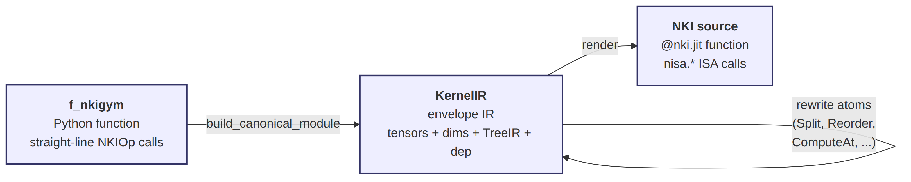
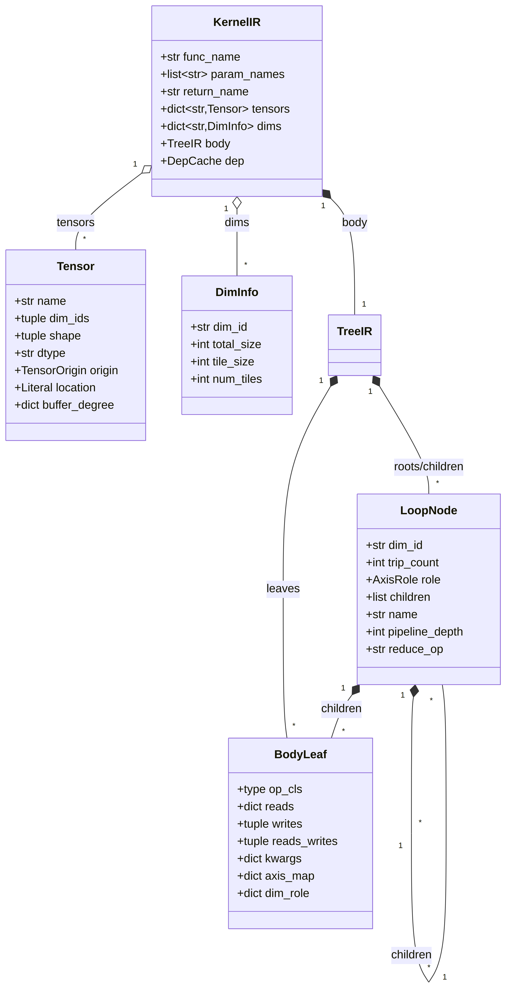
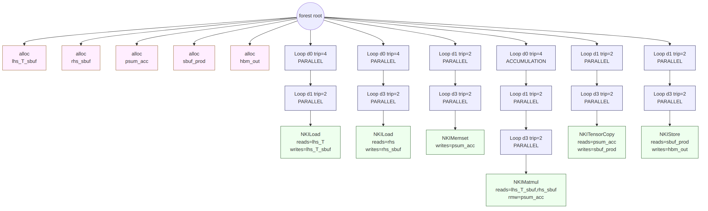
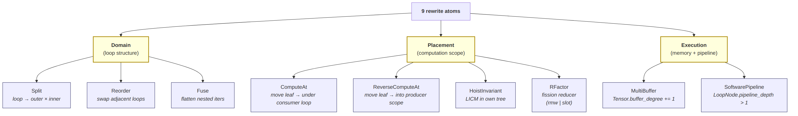
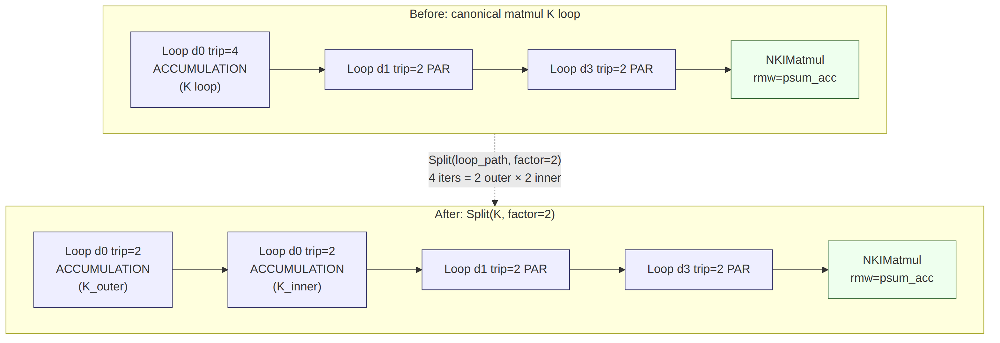
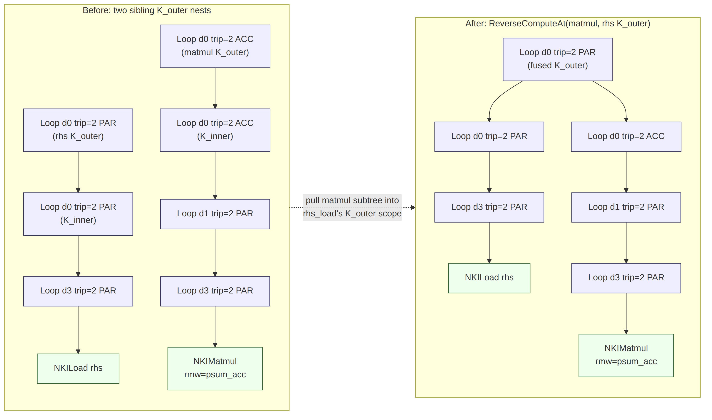
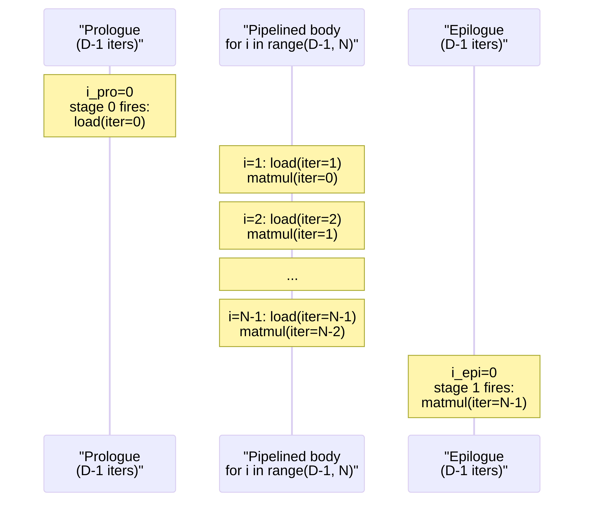

# nkigym IR Reference

## 1. Three layers

The nkigym IR is a three-layer pipeline. A math-level Python function is lifted into a schedule-tree envelope, transformed by rewrite atoms, then lowered to an `@nki.jit` kernel.



| Layer | What it is | Where it lives |
|---|---|---|
| **`f_nkigym`** | Python function of straight-line `NKIOp` calls — no loops, no branches, no helpers. Written by hand or by an agent. | `examples/*.py`, `nkigym/synthesis/` |
| **`KernelIR`** | Envelope IR. Signature, tensor / dim declarations, schedule tree (`TreeIR`), lazy `DepCache`. Built by `build_initial_ir`, mutated in place by rewrite atoms. | `nkigym/ir/ir.py` |
| **NKI source** | `@nki.jit` Python source string with explicit `for` nests and `nisa.*` ISA calls. Produced by `render(module)`. | `nkigym/codegen/render.py` |

**Core invariant:** every buffer (HBM, SBUF, PSUM) is a first-class `Tensor` in the IR with explicit `location`, `shape`, `dtype`, and one `NKIAlloc` leaf that dominates all reads and writes. Every `NKIOp` maps 1:1 to one ISA call — no phase multiplexing, no hidden buffers, no auto-expansion.

## 2. Envelope: `KernelIR`

`KernelIR` is the envelope IR. It bundles signature, tensor and dim declarations, the schedule tree, and a per-scope dependency cache.



### Field summary

| Type | Field | Description |
|---|---|---|
| `KernelIR` | `func_name` | Emitted kernel name. |
| | `param_names` | Signature order. |
| | `return_name` | Name of the return tensor. |
| | `tensors: dict[str, Tensor]` | Every named tensor, keyed by name. |
| | `axes: dict[int, Axis]` | Every logical axis, keyed by axis_id. |
| | `body: TreeIR` | Schedule tree: list of `ForNode \| SBlock` roots. |
| | `dep: DepCache` | Per-scope dependency cache (lazy rebuild). |
| `Tensor` | `name`, `dim_ids`, `shape`, `dtype` | Identity. |
| | `origin` | `"param"`, `"intermediate"`, or `"return"`. |
| | `location` | `"hbm"`, `"sbuf"`, or `"psum"`. |
| | `buffer_degree` | Multi-buffer degree per dim. Defaults to 1. |
| `Axis` | `axis_id: int`, `name: str`, `total_size`, `source_axes` | Logical axis. Identity is `axis_id` (opaque int); `name` is purely cosmetic (display in emitted source). `source_axes` traces cross-axis Fuse provenance. |
| `ForNode` | `iter_var: IterVar` | One loop over an axis, with role `PARALLEL` / `SEQUENTIAL` / `ACCUMULATION` on its iter-var. |
| | `children` | Nested loops and/or body leaves. |
| | `name` | Canonical identifier `i_<axis.name>_<ordinal>`. |
| | `pipeline_depth` | 1 = no pipeline; >1 = software-pipelined. |
| | `reduce_op` | Combinator for ACC loops. |
| `IterVar` | `var_id`, `axis_id: int`, `extent`, `role` | Stable identity for one loop iter-var. |
| `SBlock` | `op_cls` | The `NKIOp` subclass (matmul, load, ...). |
| | `reads: dict[slot, name]` | Read-only operands. |
| | `writes: tuple[name, ...]` | Write-only operands. |
| | `reads_writes: tuple[name, ...]` | RMW operands (e.g. matmul `dst`). |
| | `kwargs` | Constructor kwargs (e.g. `op="square"`, `value=0.0`). |
| | `axis_map` | Abstract axis name → `axis_id` (int). |
| | `axis_role` | `axis_id` → `AxisRole` (op-local). |

**Buffer / Allocate separation (TVM style).** `module.tensors[name]` is the tensor's identity — shape, dtype, location, dim_ids, buffer_degree. An `NKIAlloc` `BodyLeaf` is the tensor's allocation scope — its tree position dictates where the `nl.ndarray(...)` declaration is emitted. Identity-changing atoms (e.g. `MultiBuffer`) mutate `module.tensors`; scope-changing atoms (e.g. `ComputeAt` on an alloc leaf) move the `NKIAlloc` leaf. The two concerns never mix.

## 3. The NKIOp surface

Every op class in `nkigym/src/nkigym/ops/` declares its ISA signature at the class level:

| Class var | Role |
|---|---|
| `NAME` | ISA call name (e.g. `"nc_matmul"`). |
| `OPERAND_AXES` | Operand slot → abstract axis tuple (e.g. `{"stationary": ("K", "M")}`). |
| `INPUT_OPERANDS` | Read-only slots → `BodyLeaf.reads`. |
| `RMW_OPERANDS` | Read-modify-write slots → `BodyLeaf.reads_writes`. |
| `AXIS_ROLES` | Abstract axis → `AxisRole` (omitted ⇒ `PARALLEL`). |
| `MIN_TILE_SIZE` | Per-axis minimum tile size for the innermost loop. |
| `MAX_TILE_SIZE` | Per-axis maximum tile size for the innermost loop (`None` = unbounded). |
| `RFACTOR_RECIPE` | `"rmw"` (matmul), `"slot"` (activation_reduce), or `None`. |

| Class | ISA call | Purpose |
|---|---|---|
| `NKIAlloc` | `nl.ndarray` | Declare tensor storage (HBM / SBUF / PSUM). |
| `NKILoad` | `nisa.dma_copy` | HBM → SBUF copy. |
| `NKIStore` | `nisa.dma_copy` | SBUF → HBM copy. |
| `NKIDMATranspose` | `nisa.dma_transpose` | HBM ↔ SBUF transpose via DMA engine. |
| `NKIMatmul` | `nisa.nc_matmul` | Matrix multiply (Tensor Engine). |
| `NKITranspose` | `nisa.nc_transpose` | SBUF ↔ PSUM transpose. |
| `NKIActivation` | `nisa.activation` | Standalone activation. |
| `NKIActivationReduce` | `nisa.activation_reduce` | Fused activation + free-axis reduce. |
| `NKITensorScalar` | `nisa.tensor_scalar` | Elementwise tensor-scalar op with broadcast. |
| `NKITensorCopy` | `nisa.tensor_tensor` | Elementwise copy / fused op. |
| `NKITensorReduce` | `nisa.tensor_reduce` | Reduce along an axis. |
| `NKIMemset` | `nisa.memset` | Fill tensor with constant. |

## 4. Unified example

Everything below uses one kernel: `lhs_T.T @ rhs` with `K=512, M=256, N=1024`. The matmul's maximum tile sizes are `K=128, M=128, N=512`. That yields `d0(K): num_tiles=4`, `d1(M): num_tiles=2`, `d3(N): num_tiles=2`.

```python
@nkigym_kernel
def matmul_lhsT_rhs_demo(lhs_T, rhs):
    lhs_T_sbuf = NKIAlloc(location="sbuf", shape=(K, M), dtype="bfloat16")()
    rhs_sbuf   = NKIAlloc(location="sbuf", shape=(K, N), dtype="bfloat16")()
    psum_acc   = NKIAlloc(location="psum", shape=(M, N), dtype="float32")()
    sbuf_prod  = NKIAlloc(location="sbuf", shape=(M, N), dtype="bfloat16")()
    hbm_out    = NKIAlloc(location="hbm",  shape=(M, N), dtype="bfloat16")()

    NKILoad()(src=lhs_T, dst=lhs_T_sbuf)
    NKILoad()(src=rhs,   dst=rhs_sbuf)
    NKIMemset(value=0.0)(dst=psum_acc)
    NKIMatmul()(stationary=lhs_T_sbuf, moving=rhs_sbuf, dst=psum_acc)
    NKITensorCopy()(src=psum_acc, dst=sbuf_prod)
    NKIStore()(src=sbuf_prod, dst=hbm_out)
    return hbm_out
```

`build_initial_ir` parses the AST, unifies abstract axes (`K`, `M`, `N`) into concrete dim ids (`d0`, `d1`, `d3`), derives per-dim tile sizes from `NKIOp.MIN_TILE_SIZE` and `NKIOp.MAX_TILE_SIZE`, tags tensor origins, and builds the canonical forest.

### 4.1 Canonical form

Alloc leaves sit at the forest root in source order. Each compute/copy op gets its own per-dim loop nest built from the op's `MIN_TILE_SIZE` and `MAX_TILE_SIZE`: for each axis, an outer loop with `trip_count = num_tiles = axis_extent / MAX_TILE_SIZE` (or `trip_count = 1` if `MAX_TILE_SIZE` is `None`) and an inner tile loop with `trip_count = MAX_TILE_SIZE` (or `trip_count = axis_extent` if unbounded). The canonical builder emits both loops explicitly. The renderer later elides the innermost tile loop, absorbing its extent as the slice width on the ISA call.



```text
body:
  Alloc lhs_T_sbuf, rhs_sbuf, psum_acc, sbuf_prod, hbm_out          (5 root leaves)
  Loop d0/PAR trip=4 → Loop d1/PAR trip=2 → NKILoad(lhs_T)         (simplified: each shows outer loop only)
  Loop d0/PAR trip=4 → Loop d3/PAR trip=2 → NKILoad(rhs)
  Loop d1/PAR trip=2 → Loop d3/PAR trip=2 → NKIMemset(psum_acc)
  Loop d0/ACC trip=4 → Loop d1/PAR trip=2 → Loop d3/PAR trip=2 → NKIMatmul
  Loop d1/PAR trip=2 → Loop d3/PAR trip=2 → NKITensorCopy
  Loop d1/PAR trip=2 → Loop d3/PAR trip=2 → NKIStore
```

Rendered kernel (canonical):

```python
@nki.jit
def matmul_lhsT_rhs_demo(lhs_T, rhs):
    lhs_T_sbuf = nl.ndarray((128, 4, 256),  dtype=nl.bfloat16, buffer=nl.sbuf)
    rhs_sbuf   = nl.ndarray((128, 4, 1024), dtype=nl.bfloat16, buffer=nl.sbuf)
    psum_acc   = nl.ndarray((128, 2, 1024), dtype=nl.float32,  buffer=nl.psum)
    sbuf_prod  = nl.ndarray((128, 2, 1024), dtype=nl.bfloat16, buffer=nl.sbuf)
    hbm_out    = nl.ndarray((256, 1024),    dtype=nl.bfloat16, buffer=nl.shared_hbm)
    for i_d0_0 in range(4):
        for i_d1_0 in range(2):
            nisa.dma_copy(dst=lhs_T_sbuf[0:128, i_d0_0, i_d1_0*128 : i_d1_0*128+128],
                          src=lhs_T    [i_d0_0*128 : i_d0_0*128+128, i_d1_0*128 : i_d1_0*128+128])
    for i_d0_0 in range(4):
        for i_d3_0 in range(2):
            nisa.dma_copy(dst=rhs_sbuf[0:128, i_d0_0, i_d3_0*512 : i_d3_0*512+512],
                          src=rhs    [i_d0_0*128 : i_d0_0*128+128, i_d3_0*512 : i_d3_0*512+512])
    for i_d1_0 in range(2):
        for i_d3_0 in range(2):
            nisa.memset(psum_acc[0:128, i_d1_0, i_d3_0*512 : i_d3_0*512+512], value=0.0)
    for i_d0_0 in range(4):
        for i_d1_0 in range(2):
            for i_d3_0 in range(2):
                nisa.nc_matmul(
                    dst       = psum_acc  [0:128, i_d1_0, i_d3_0*512 : i_d3_0*512+512],
                    stationary= lhs_T_sbuf[0:128, i_d0_0, i_d1_0*128 : i_d1_0*128+128],
                    moving    = rhs_sbuf  [0:128, i_d0_0, i_d3_0*512 : i_d3_0*512+512],
                )
    for i_d1_0 in range(2):
        for i_d3_0 in range(2):
            nisa.tensor_copy(sbuf_prod[0:128, i_d1_0, i_d3_0*512 : i_d3_0*512+512],
                             psum_acc [0:128, i_d1_0, i_d3_0*512 : i_d3_0*512+512])
    for i_d1_0 in range(2):
        for i_d3_0 in range(2):
            nisa.dma_copy(dst=hbm_out[i_d1_0*128 : i_d1_0*128+128, i_d3_0*512 : i_d3_0*512+512],
                          src=sbuf_prod[0:128, i_d1_0, i_d3_0*512 : i_d3_0*512+512])
    return hbm_out
```

All six ops run as independent loop nests: every intermediate is held in SBUF / PSUM at full extent (`num_tiles=4` for `lhs_T_sbuf` and `rhs_sbuf`, etc.). This is a correct but heavy baseline — rewrites narrow LCAs, fuse producers into consumers, and expose pipelining opportunities.

## 5. Atom taxonomy

Nine rewrite atoms, grouped TVM-style into three categories.



### Domain — loop structure

| Atom | What it does | Legality |
|---|---|---|
| `Split` | Partitions a loop into `outer × inner` when `factor` divides `trip_count`. | Target is a `ForNode`, `1 < factor < trip_count`, `trip_count % factor == 0`. For every op leaf whose tile-axis innermost loop is the target, the new innermost extent must satisfy `MIN_TILE_SIZE ≤ extent ≤ MAX_TILE_SIZE`. Non-divisors raise `AtomLegalityError` — no tail siblings, no predication. |
| `Reorder` | Swaps an outer `ForNode` with its unique `ForNode` child. | Perfect-nest shape + role commutes: `PAR × PAR` always; `ACC × ACC` iff same `reduce_op`; `PAR × ACC` iff subtree is pure w.r.t. the PAR dim; `SEQ` never. |
| `Fuse` | Flattens adjacent nested loops on the same axis into one loop whose extent is the product of the inputs. | All input loops are adjacent ancestors on the same axis. For every op leaf affected by the fuse, the new innermost tile extent on that axis must satisfy `MIN_TILE_SIZE ≤ extent ≤ MAX_TILE_SIZE`. |

### Placement — computation scope

| Atom | What it does | Legality |
|---|---|---|
| `ComputeAt` | Moves a producer leaf under a consumer loop; regenerates uncovered dims. Subsumes the old `FuseLoops` atom. | Target is not an ancestor of the leaf; target's subtree contains a consumer of the leaf's writes. |
| `ReverseComputeAt` | Dual of `ComputeAt`. Moves a consumer leaf into a producer's scope. | Target's subtree contains a producer of one of the leaf's reads. |
| `HoistInvariant` | Intra-own-tree LICM. Pulls a leaf out of loops whose dim it does not reference. | Target is a strict ancestor; no crossed loop has a dim in the leaf's `axis_map` / `dim_role`. |
| `RFactor` | Fissions a reducer into outer-split + staging + closing `tensor_reduce`. Recipes: `"rmw"` (matmul PSUM) and `"slot"` (activation_reduce slot-writes). | Reducer op has `RFACTOR_RECIPE`; `outer_factor` divides the accumulation dim's `num_tiles`, strictly between 1 and `num_tiles`. |

### Execution — memory and pipeline

| Atom | What it does | Legality |
|---|---|---|
| `MultiBuffer` | Sets `Tensor.buffer_degree[dim] = degree`. Renderer widens the P-slot dim at emit time. | Tensor is intermediate (not param/return); `1 ≤ degree ≤ num_tiles(dim) / required_tiles(dim)`. The upper bound is the tensor's LCA-derived slot count — more slots waste SBUF without changing semantics. |
| `SoftwarePipeline` | Sets `LoopNode.pipeline_depth = depth`. Renderer emits prologue / body / epilogue. | Target is a `LoopNode`; `depth == chain length of subtree` (number of distinct `BodyLeaf`s). The renderer clamps to `min(pipeline_depth, max_stage+1, trip_count)` if later rewrites shrink the chain. |

Every atom is a frozen dataclass with `is_legal(module) -> bool` and `apply(module) -> KernelIR`. The batch sampler enumerates all legal atoms from the current state, picks one uniformly at random, and applies it; state deduplication is via `hash_forest`.

## 6. Unified trace: four atoms

We now walk a four-atom trace on the unified example. At each step the tree changes, buffer LCAs shrink, and the rendered source reorganises to match.

### 6.1 Step 1 — `Split(matmul K loop, factor=2)`

Partition the matmul's K loop (`d0`, `trip=4`, `ACCUMULATION`) into outer × inner, each `trip=2`.



```text
before:
  Loop d0/ACC trip=4 → Loop d1 → Loop d3 → NKIMatmul

after:
  Loop d0/ACC trip=2 → Loop d0/ACC trip=2 → Loop d1 → Loop d3 → NKIMatmul
```

The rendered matmul nest becomes:

```python
for i_d0_0 in range(2):
    for i_d0_1 in range(2):
        for i_d1_0 in range(2):
            for i_d3_0 in range(2):
                nisa.nc_matmul(
                    dst       = psum_acc  [0:128, i_d1_0,           i_d3_0*512 : i_d3_0*512+512],
                    stationary= lhs_T_sbuf[0:128, i_d0_0*2 + i_d0_1, i_d1_0*128 : i_d1_0*128+128],
                    moving    = rhs_sbuf  [0:128, i_d0_0*2 + i_d0_1, i_d3_0*512 : i_d3_0*512+512],
                )
```

The slot expression `i_d0_0 * 2 + i_d0_1` falls out automatically: both `ForNode`s carry iter-vars with the same `axis_id` (the d0 axis), so `slot_expr` multiplies loop vars by tail-trip products.

### 6.2 Step 2 — `Split(rhs_load K loop, factor=2)` + `ReverseComputeAt(matmul, rhs_load K_outer)`

Split the `rhs_load`'s K loop the same way, then pull the matmul subtree into that K_outer scope. The result: load → matmul ordering inside one shared K_outer loop, which is the prefetch pattern software pipelining will consume.



```text
before (after both Splits, two sibling K_outer nests):
  Loop d0/PAR trip=2 (rhs K_outer)
    → Loop d0/PAR trip=2 → Loop d3 → NKILoad(rhs)
  Loop d0/ACC trip=2 (matmul K_outer)
    → Loop d0/ACC trip=2 → Loop d1 → Loop d3 → NKIMatmul

after ReverseComputeAt:
  Loop d0/PAR trip=2 (shared K_outer)
    → Loop d0/PAR trip=2 → Loop d3 → NKILoad(rhs)
    → Loop d0/ACC trip=2 → Loop d1 → Loop d3 → NKIMatmul
```

`ReverseComputeAt.apply` removes the matmul subtree, regenerates whatever dims the shared K_outer doesn't already cover, and appends the matmul subtree under K_outer. The rendered kernel now runs load and matmul inside one loop:

```python
for i_d0_0 in range(2):                        # shared K_outer
    for i_d0_1 in range(2):                    # load's K_inner
        for i_d3_0 in range(2):
            nisa.dma_copy(dst=rhs_sbuf[0:128, i_d0_0*2 + i_d0_1, ...],
                          src=rhs    [(i_d0_0*2 + i_d0_1)*128 : ..., ...])
    for i_d0_1 in range(2):                    # matmul's K_inner
        for i_d1_0 in range(2):
            for i_d3_0 in range(2):
                nisa.nc_matmul(
                    dst       = psum_acc  [0:128, i_d1_0, ...],
                    stationary= lhs_T_sbuf[0:128, i_d0_0*2 + i_d0_1, ...],
                    moving    = rhs_sbuf  [0:128, i_d0_0*2 + i_d0_1, ...],
                )
```

### 6.3 Step 3 — `SoftwarePipeline(K_outer, depth=2)`

With load and matmul as two `BodyLeaf`s under the shared K_outer, the loop's chain length is 2 — enough for a depth-2 pipeline.



`SoftwarePipeline` sets `LoopNode.pipeline_depth = 2`. The renderer calls `assign_stages` to assign each leaf a stage (load=0, matmul=1 via read-after-write chain) and emits:

* **Prologue** (`D-1 = 1` unrolled iter): stage-0 load fires at constant `i_pro=0`, priming `rhs_sbuf` for the body's first matmul.
* **Pipelined body** (`for i_d0_0 in range(1, 2)`): both leaves fire every iter; slot expressions for `d0` in the matmul substitute the innermost `d0` ancestor with `(loop_var - 1)` so matmul reads the previously-loaded tile.
* **Epilogue** (`D-1 = 1` unrolled iter): stage-1 matmul fires at absolute `i_d0_0 = N + 0 - 1 = N-1`, draining the last loaded tile.

Rendered K_outer region:

```python
# Prologue — prime stage 0 (load).
for i_d0_1 in range(2):
    for i_d3_0 in range(2):
        nisa.dma_copy(dst=rhs_sbuf[0:128, i_d0_1*2 + 0, ...],
                      src=rhs     [(i_d0_1*2 + 0)*128 : ..., ...])

# Pipelined body — both stages fire; matmul reads the previously-loaded tile via (i_d0_0 - 1).
for i_d0_0 in range(1, 2):
    for i_d0_1 in range(2):
        for i_d3_0 in range(2):
            nisa.dma_copy(dst=rhs_sbuf[0:128, i_d0_0*2 + i_d0_1, ...], ...)
    for i_d0_1 in range(2):
        for i_d1_0 in range(2):
            for i_d3_0 in range(2):
                nisa.nc_matmul(
                    dst       = psum_acc  [0:128, i_d1_0, ...],
                    stationary= lhs_T_sbuf[0:128, (i_d0_0*2 + (i_d0_1 - 1)) % 4, ...],
                    moving    = rhs_sbuf  [0:128, (i_d0_0*2 + (i_d0_1 - 1)) % 4, ...],
                )

# Epilogue — drain stage 1 (matmul) on the last tile.
for i_d0_1 in range(2):
    for i_d1_0 in range(2):
        for i_d3_0 in range(2):
            nisa.nc_matmul(
                dst       = psum_acc  [0:128, i_d1_0, ...],
                stationary= lhs_T_sbuf[0:128, i_d0_1*2 + 1, ...],
                moving    = rhs_sbuf  [0:128, i_d0_1*2 + 1, ...],
            )
```

Total firings match the un-pipelined case (`N=2` iters for each stage). The `% 4` falls out of the slot expression when `total_slots < ancestor_trip_product`: after pipelining the slot count no longer matches the raw trip product, so the slot modulo is emitted.

## 7. Rendering pipeline

`render(module)` orchestrates five passes over the tree:

1. **`place_buffers`** — compute tensor shapes + slot counts from LCA walks. `required_tiles(tensor, dim) = num_tiles(dim) / product_of_dim_trips_above_LCA`. Cross-nest tensors get `required_tiles == num_tiles`; fully intra-nest tensors get `1`. `total_slots = required_tiles * buffer_degree`.
2. **`inject_multi_buffer`** — slot-index expressions for multi-buffered tiles. Emits `(raw_slot) % total_slots` when slots collapse under a narrowed LCA or a pipeline offset.
3. **`inject_software_pipeline`** — prologue / body / epilogue for `LoopNode.pipeline_depth > 1`. Per-leaf stages from `assign_stages` (`reads`-after-`writes` chain).
4. **`emit_ops`** — per-`op_cls` body emitters keyed by class name (`_emit_NKIMatmul` → `nisa.nc_matmul(...)`).
5. **`emit_source`** — top-level walker. Opens / closes `for` headers; delegates each `BodyLeaf` to its emitter.

The renderer is mechanical: every `LoopNode` emits, every leaf emits exactly one ISA call, `NKIAlloc` emits `<name> = nl.ndarray(<shape>, dtype=nl.<dtype>, buffer=<location>)` at the leaf's tree position. No implicit rewrites.

### 7.1 Innermost Tile Loop Elision

The canonical builder emits **two** nested `ForNode`s per op axis: an outer trip loop with extent `axis_extent / MAX_TILE_SIZE[axis]` and an inner tile loop with extent `MAX_TILE_SIZE[axis]`. For unbounded axes (`MAX_TILE_SIZE[axis] is None`), the outer has trip 1 and the inner has the full extent.

The renderer (`emit_source.py`) walks the tree and collects the set of innermost-tile iter-var IDs per op leaf. For any `ForNode` whose iter-var is the innermost tile of at least one descendant leaf, the renderer emits no `for` header — the iter-var's extent is consumed as the slice width on the ISA call's buffer-access pattern.

This pattern mirrors TVM's `Tensorize` primitive: in TVM every loop is scalar, and `Tensorize(loop, intrin_name)` replaces the inner loop with the intrinsic call. nkigym's renderer performs the equivalent "tensorize" step implicitly based on `MAX_TILE_SIZE` metadata on the op class.

**Example:** For a matmul with `M=256, MAX_TILE_SIZE["M"]=128`, the canonical builder emits:

```python
Loop d_M outer trip=2
  Loop d_M inner trip=128
    NKIMatmul(...)
```

The renderer identifies the inner `d_M` loop as the innermost tile loop for the matmul's M axis. It emits:

```python
for i_d_M_0 in range(2):   # outer trip loop
    nisa.nc_matmul(
        dst=psum_acc[0:128, i_d_M_0, ...],   # slice width = 128 from the elided inner loop
        ...
    )
```

The inner loop does not appear as a `for` statement; its extent `128` becomes the slice width `0:128` on the ISA call.

## 8. `validate_dataflow_ordering`

`validate_dataflow_ordering(module)` enforces dataflow legality in pre-order DFS emission order:

1. **Alloc precedes use.** A tensor name cannot appear in any prior leaf's `reads` / `writes` / `reads_writes` before its `NKIAlloc` leaf.
2. **Non-alloc leaves require allocated operands.** Every non-param name in `reads ∪ writes ∪ reads_writes` must be alloc'd first.
3. **Reads after writes.** Every non-param name in `reads ∪ reads_writes` must be in the `written` set by some prior leaf.
4. **RMW finalization.** For a tensor T with any RMW writer, every non-RMW read of T must appear after the LAST RMW write. This is the structural reason matmul's accumulation loop closes before the `NKITensorCopy` drain fires.
5. **Return produced.** Every tensor with `origin == "return"` must be in the `written` set by the end of the forest walk.

The validator is the single source of truth for dataflow legality. No op-specific carve-outs.

## 9. File map

```
nkigym/src/nkigym/
├── __init__.py                         # Lazy __getattr__ for nkigym_compile
├── ops/
│   ├── base.py                         # NKIOp base class, AxisRole
│   ├── alloc.py                        # NKIAlloc
│   ├── load.py / store.py              # NKILoad / NKIStore
│   ├── dma_transpose.py                # NKIDMATranspose
│   ├── matmul.py                       # NKIMatmul (RFACTOR_RECIPE="rmw")
│   ├── transpose.py                    # NKITranspose
│   ├── activation.py                   # NKIActivation
│   ├── activation_reduce.py            # NKIActivationReduce (RFACTOR_RECIPE="slot")
│   ├── tensor_scalar.py                # NKITensorScalar
│   ├── tensor_copy.py                  # NKITensorCopy
│   ├── tensor_reduce.py                # NKITensorReduce
│   └── memset.py                       # NKIMemset
├── ir/
│   ├── ir.py                           # KernelIR, Tensor, Axis, IterVar, ForNode, SBlock, validate_dataflow_ordering
│   ├── dep_cache.py                    # DepCache (per-scope dependency tracking)
│   └── build.py                        # build_initial_ir (AST parse → KernelIR)
├── codegen/                            # KernelIR → NKI source (flat)
│   ├── render.py                       # render entry point; pipeline orchestrator
│   ├── inject_annotations.py           # Dispatcher for annotation-keyed sub-passes
│   ├── buffer_degree.py                # Widens Tensor.buffer_degree
│   ├── software_pipeline.py            # software_pipeline_depth sub-pass
│   ├── place_buffers.py                # LCA-based buffer placement
│   ├── canonicalize_names.py           # i_<dim>_<ordinal> ForNode naming
│   ├── emit_ops.py                     # Per-op_cls ISA emitters
│   ├── emit_source.py                  # Forest walker, NKI source string
│   └── _emit_utils.py                  # Shared slice / name helpers
├── tune/
│   ├── __init__.py                     # KernelRewrite protocol, AtomLegalityError
│   ├── split.py                        # Split
│   ├── reorder.py                      # Reorder
│   ├── fuse.py                         # Fuse (excluded from default sampler)
│   ├── compute_at.py                   # ComputeAt
│   ├── reverse_compute_at.py           # ReverseComputeAt
│   ├── hoist_invariant.py              # HoistInvariant
│   ├── multi_buffer.py                 # MultiBuffer
│   ├── software_pipeline.py            # SoftwarePipeline
│   ├── rfactor.py                      # RFactor (rmw | slot recipes)
│   ├── batch.py                        # Frontier-based rewrite sampling
│   └── verify.py                       # CPU-sim verification helper
└── synthesis/                          # Agent-driven f_nkigym synthesis
```

## 10. References

* **Spec:** `docs/superpowers/specs/2026-05-09-first-class-buffers-and-rfactor-design.md`
* **Plan:** `docs/superpowers/plans/2026-05-09-first-class-buffers-and-rfactor.md`
* **Follow-ups:** `docs/superpowers/plans/2026-05-09-first-class-buffers-and-rfactor-followups.md`
* **Canonical-1N design:** `docs/superpowers/specs/2026-05-08-canonical-1N-and-computeat-partial-coverage-design.md`
